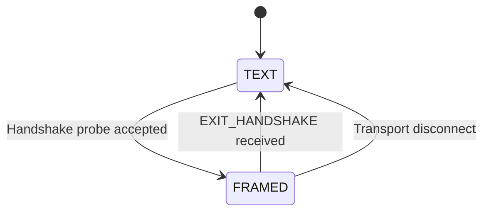
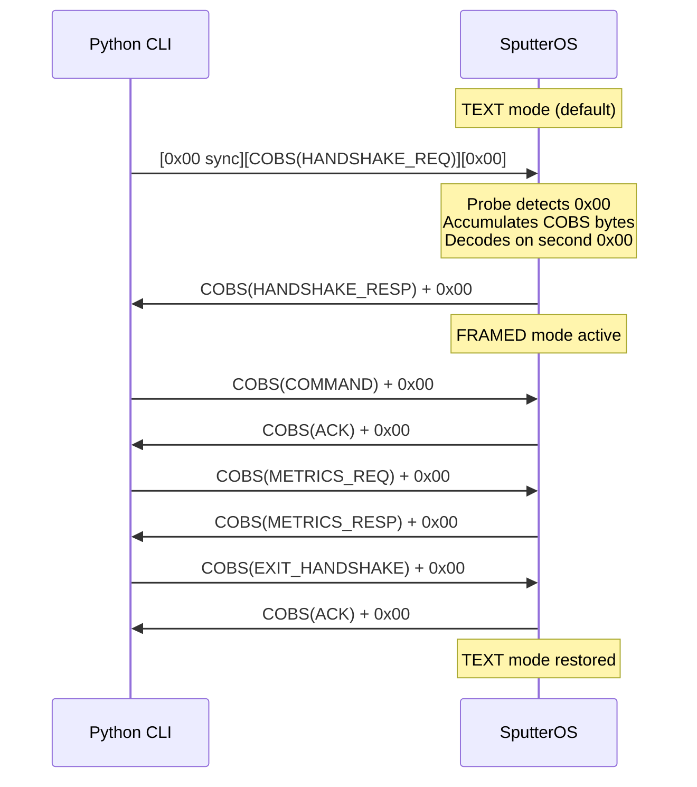

# SputterOS Communications Protocol

This document specifies the dual-mode communications protocol used by SputterOS, covering the TEXT (legacy ASCII) mode and the FRAMED (COBS-encoded binary) mode.

---

## Table of Contents

1. [Overview](#overview)
2. [Dual-Mode Architecture](#dual-mode-architecture)
3. [TEXT Mode (Legacy)](#text-mode-legacy)
4. [FRAMED Mode](#framed-mode)
5. [Wire Format](#wire-format)
6. [Message Types](#message-types)
7. [Payload Schemas](#payload-schemas)
8. [Handshake Sequence](#handshake-sequence)
9. [Exit Handshake](#exit-handshake)
10. [Error Handling](#error-handling)
11. [Python CLI (`sputterctl`)](#python-cli-sputterctl)
12. [Header Reference](#header-reference)

---

## Overview

SputterOS supports two serial communication modes:

| Mode | Transport | Use Case | Encoding |
|---|---|---|---|
| **TEXT** | Any serial terminal | Human debugging, bring-up | ASCII `<CmdID> <device> <value>\n` |
| **FRAMED** | Python CLI / automation | Structured control, metrics | COBS + CRC16-CCITT |

The device starts in TEXT mode. A host tool (e.g. `sputterctl`) can negotiate FRAMED mode via a handshake. When the host disconnects, the device reverts to TEXT mode automatically.

---

## Dual-Mode Architecture



### C++ Components

| Header | Role |
|---|---|
| `CLI<Cfg, MaxPayload>` | Dual-mode byte processor — branches `tick()` on active mode |
| `ScheduledCommsTask<Cfg>` | Implements `IProtocolHandler<Cfg>` — handles handshake, ACK/NACK, metrics |
| `ProtocolRouter<Cfg>` | Decodes frames and dispatches to `IProtocolHandler` callbacks |
| `FrameEncoder<MaxPayload>` | Builds COBS wire frames from message type + payload |
| `FrameDecoder<MaxPayload>` | Stateful byte-by-byte frame accumulator |
| `ResponseSerializer` | Payload serializers for ACK, NACK, handshake response, log, data |

### Python Components

| Module | Role |
|---|---|
| `sputterctl.protocol` | Frame encode/decode, CRC16, message types, payload serializers |
| `sputterctl.cobs` | Pure-Python COBS encode/decode |
| `sputterctl.client` | High-level threaded client with handshake lifecycle |
| `sputterctl.transport` | Serial and TCP transport abstraction |

---

## TEXT Mode (Legacy)

TEXT mode is the default after boot. It accepts human-readable ASCII commands and returns ASCII responses. See the [Implementation Guide](ImplementationGuide.md#serial-command-protocol) for full details.

### Wire Format

```
→ <CmdID> <targetDevice> <value>\n
← ACK <cmdId>\n
← NACK <cmdId> <targetDevice> <value>\n
```

### Probe Detection

While in TEXT mode, `CLI` monitors for a leading `0x00` byte — the COBS frame delimiter. Since valid ASCII text never contains `0x00`, this reliably signals a FRAMED mode handshake attempt:

1. `0x00` received → set `m_probeActive`, clear probe buffer
2. Subsequent non-zero bytes accumulate in probe buffer
3. Next `0x00` → attempt COBS decode of probe buffer
4. If decode yields a valid `HANDSHAKE_REQ` → transition to FRAMED mode
5. If decode fails → discard, remain in TEXT mode

---

## FRAMED Mode

### COBS Encoding

All frames use [Consistent Overhead Byte Stuffing (COBS)](https://en.wikipedia.org/wiki/Consistent_Overhead_Byte_Stuffing). COBS guarantees:

- Encoded output never contains `0x00`
- Maximum overhead: 1 byte per 254 bytes of input
- Simple, constant-time encode/decode

### Frame Delimiter

`0x00` — separates frames on the wire. Both COBS-encoded data and the delimiter together form a complete wire frame.

---

## Wire Format

A single wire frame:

```
┌──────────────────────────────────────────────────┐
│  COBS( [Header 4B] [Payload NB] [CRC16 2B] )    │  0x00
└──────────────────────────────────────────────────┘
           Raw frame (before COBS)                    Delimiter
```

### Header (4 bytes)

| Offset | Size | Field | Description |
|--------|------|-------|-------------|
| 0 | 1 | `MsgType` | `MessageType` enum value |
| 1 | 1 | `SeqNum` | Sequence number (0–255, wrapping) |
| 2 | 2 | `PayloadLen` | Little-endian payload length |

### Trailer (2 bytes)

| Offset | Size | Field | Description |
|--------|------|-------|-------------|
| H+N | 2 | `CRC16` | CRC16-CCITT over header + payload (poly 0x1021, init 0xFFFF) |

### Maximum Sizes

| Constant | Value | Notes |
|---|---|---|
| `kFrameHeaderSize` | 4 | MsgType + SeqNum + PayloadLen |
| `kFrameTrailerSize` | 2 | CRC16 |
| `kFrameOverhead` | 6 | Header + Trailer |
| Default `MaxPayload` | 256 | Configurable via `Cfg::kMaxFramePayload` |
| Max raw frame | 262 | Header + 256 payload + Trailer |
| Max wire frame | ~264 | COBS overhead + delimiter |

---

## Message Types

### Host → Device

| Name | Value | Payload | Description |
|------|-------|---------|-------------|
| `COMMAND` | `0x01` | 6 bytes | Send a control command |
| `HANDSHAKE_REQ` | `0x02` | 6 bytes | Request FRAMED mode |
| `METRICS_REQ` | `0x03` | 0 bytes | Request performance metrics |
| `EXIT_HANDSHAKE` | `0x04` | 0 bytes | Revert to TEXT mode |

### Device → Host

| Name | Value | Payload | Description |
|------|-------|---------|-------------|
| `ACK` | `0x81` | 1 byte | Command accepted |
| `NACK` | `0x82` | 6 bytes | Command rejected |
| `HANDSHAKE_RESP` | `0x83` | 6 bytes | Handshake confirmation |
| `TELEMETRY` | `0x84` | variable | User-defined telemetry |
| `METRICS_RESP` | `0x85` | variable | Performance metrics snapshot |
| `LOG` | `0x86` | 1 + N bytes | Structured log message |
| `DATA` | `0x87` | variable | User-defined data blob |
| `PERF_DATA` | `0x88` | variable | Performance data |

### Bidirectional

| Name | Value | Payload | Description |
|------|-------|---------|-------------|
| `HEARTBEAT` | `0xF0` | 0 bytes | Keepalive ping/pong |

---

## Payload Schemas

### COMMAND (0x01) — 6 bytes

```
[CmdID:1][Device:1][Value:4LE]
```

| Field | Type | Description |
|---|---|---|
| CmdID | `uint8_t` | `Cfg::CmdID` enum value |
| Device | `uint8_t` | Target device index |
| Value | `float` (LE) | Command parameter |

### HANDSHAKE_REQ (0x02) — 6 bytes

```
[Version:2LE][Magic:4LE]
```

| Field | Type | Value |
|---|---|---|
| Version | `uint16_t` (LE) | Protocol version (currently `1`) |
| Magic | `uint32_t` (LE) | `0x53504F53` ("SPOS") |

### HANDSHAKE_RESP (0x83) — 6 bytes

Same layout as HANDSHAKE_REQ. The device echoes its supported version and the magic number to confirm.

### ACK (0x81) — 1 byte

```
[CmdID:1]
```

Echoes back the accepted command ID.

### NACK (0x82) — 6 bytes

```
[CmdID:1][Device:1][Value:4LE]
```

Echoes back the rejected command (typically: queue full).

### LOG (0x86) — 1 + N bytes

```
[Level:1][Text:N]
```

| Field | Description |
|---|---|
| Level | Log severity (0=CRITICAL, 1=STATUS, 2=INFO, 3=DEBUG) |
| Text | UTF-8 string (no null terminator) |

### EXIT_HANDSHAKE (0x04) — 0 bytes

No payload. Device responds with ACK then reverts to TEXT mode.

### METRICS_REQ (0x03) — 0 bytes

No payload. Device responds with METRICS_RESP containing the current performance snapshot.

---

## Handshake Sequence



### Key Points

1. **Leading sync byte**: The host must prepend `0x00` before the COBS-encoded HANDSHAKE_REQ. This byte triggers probe mode in the TEXT parser.
2. **Magic validation**: The device verifies `kHandshakeMagic` (`0x53504F53`) before accepting the handshake.
3. **Version negotiation**: Both sides exchange `kProtocolVersion`. Future versions may add feature negotiation.

---

## Exit Handshake

To cleanly return to TEXT mode:

1. Host sends `EXIT_HANDSHAKE` frame (MsgType `0x04`, no payload)
2. Device responds with `ACK` frame (echoing `0x04` as payload)
3. Device calls `CLI::exitFramedMode()` — mode reverts to TEXT
4. Any subsequent bytes are parsed as ASCII commands

If the transport disconnects without an exit handshake, the device remains in FRAMED mode until reset. Implementing a heartbeat timeout to auto-revert is recommended for production deployments.

---

## Error Handling

| Error | Behaviour |
|---|---|
| CRC mismatch | Frame silently discarded |
| Truncated COBS data | Frame silently discarded |
| Unknown MessageType | Frame silently discarded |
| Payload length mismatch | Frame silently discarded |
| Invalid handshake magic | Frame discarded, TEXT mode continues |
| Probe timeout (no second 0x00) | Probe buffer discarded after overflow |

The protocol is designed for robustness: malformed data never crashes the system or leaves it in an inconsistent state.

---

## Python CLI (`sputterctl`)

### Installation

```bash
cd tools/cli
pip install -e ".[dev]"
```

### Commands

```bash
# Interactive REPL
sputterctl repl --port COM3

# Single command (TCP loopback)
sputterctl send --host localhost --port 9000 --cmd "1 0 50.0"

# Live metrics monitor
sputterctl monitor --port COM3 --interval 1.0
```

### Transport Options

| Flag | Default | Description |
|---|---|---|
| `--port` | — | Serial port (e.g. `COM3`, `/dev/ttyACM0`) |
| `--baud` | 115200 | Serial baud rate |
| `--host` | — | TCP host (mutually exclusive with `--port`) |
| `--tcp-port` | 9000 | TCP port for socket transport |

### Tests

```bash
cd tools/cli
python -m pytest tests/ -v
```

44 Python tests covering COBS, protocol, transport, and client lifecycle.

---

## Header Reference

| Header | Location |
|---|---|
| `CobsCodec.h` | `include/sputteros/comms/protocol/` |
| `Crc16.h` | `include/sputteros/comms/protocol/` |
| `MessageType.h` | `include/sputteros/comms/protocol/` |
| `FrameConstants.h` | `include/sputteros/comms/protocol/` |
| `FrameEncoder.h` | `include/sputteros/comms/protocol/` |
| `FrameDecoder.h` | `include/sputteros/comms/protocol/` |
| `CommsMode.h` | `include/sputteros/comms/protocol/` |
| `IProtocolHandler.h` | `include/sputteros/comms/protocol/` |
| `ProtocolRouter.h` | `include/sputteros/comms/protocol/` |
| `ResponseSerializer.h` | `include/sputteros/comms/protocol/` |
| `CLI.h` | `include/sputteros/comms/` |

See the individual header Doxygen comments for API details.
