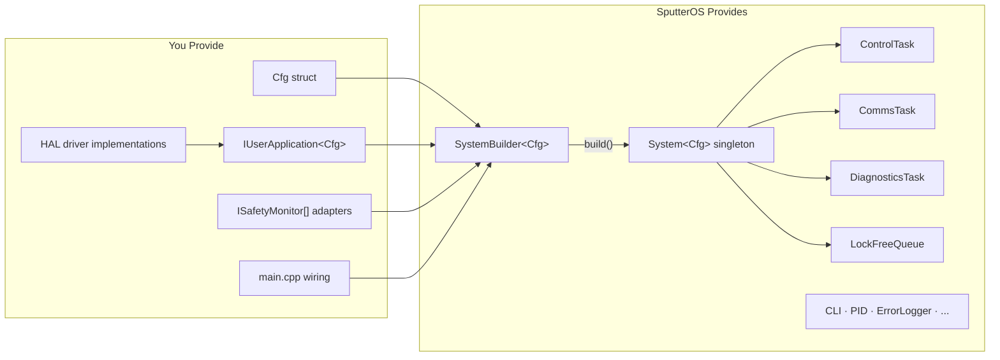
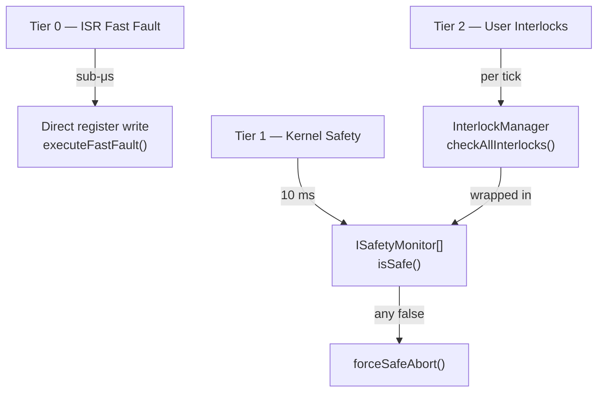

# SputterOS Implementation Guide

A step-by-step walkthrough for integrating SputterOS into your vacuum control project.

---

## Table of Contents

1. [Responsibility Split](#responsibility-split)
2. [Step 1 — Add SputterOS to Your Project](#step-1--add-sputteros-to-your-project)
3. [Step 2 — Define Your Config Struct](#step-2--define-your-config-struct)
4. [Step 3 — Implement HAL Interfaces](#step-3--implement-hal-interfaces)
5. [Step 4 — Implement IUserApplication](#step-4--implement-iuserapplication)
6. [Step 5 — Implement IProcessState Phases](#step-5--implement-iprocessstate-phases)
7. [Step 6 — Implement ISafetyMonitor Adapters](#step-6--implement-isafetymonitor-adapters)7. [Step 6.5 — Register Device Dependencies on Custom Tasks](#step-65--register-device-dependencies-on-custom-tasks)8. [Step 7 — Wire Everything in main.cpp](#step-7--wire-everything-in-maincpp)
9. [Safety System Reference](#safety-system-reference)
10. [Serial Command Protocol](#serial-command-protocol)
11. [TelemetryLogger](#telemetrylogger)
12. [Troubleshooting](#troubleshooting)

---

## Responsibility Split



| SputterOS Provides | You Provide |
|---|---|
| `ControlTask<Cfg>` — deterministic safety + tick loop | Concrete `IUserApplication<Cfg>` |
| `CommsTask<Cfg>` — serial command parsing | Concrete `IProcessState` per process phase |
| `DiagnosticsTask` — watchdog, timing, memory | Concrete HAL implementations (drivers) |
| `SystemBuilder<Cfg>` — declarative wiring | `ISafetyMonitor` adapters (interlock, arc) |
| `LockFreeQueue`, `WatchdogSync`, `MultiCoreSync` | Your `Cfg` struct (ConfigTraits contract) |
| `InterlockManager`, `CLI`, `PIDController`, `ErrorLogger` | Platform `main.cpp` — `SystemBuilder` wiring |
| 1 dummy HAL stub for bring-up | OSAL bindings (if needed beyond built-in) |

SputterOS **never touches hardware directly**. Every GPIO, UART handle, and OS primitive is injected through pure abstract interfaces.

---

## Step 1 — Add SputterOS to Your Project

### 1a. Add as Git Submodule

```bash
git submodule add <repo-url> lib/SputterOS
git submodule update --init --recursive
```

### 1b. Wire CMake

```cmake
add_subdirectory(lib/SputterOS)

add_executable(my_controller
    src/main.cpp
    src/MyProcessApp.cpp
    src/hal_impl/AnalogPiraniGauge.cpp
    src/hal_impl/GPIO_RelayControl.cpp
    # ... your implementation files
)

target_link_libraries(my_controller PRIVATE SputterOS)

target_include_directories(my_controller PRIVATE
    ${CMAKE_CURRENT_SOURCE_DIR}/include
)
```

No include-path injection into SputterOS is needed. Your `Cfg` struct is passed as a template argument.

See [ExampleProjectStructure.md](ExampleProjectStructure.md) for a complete reference directory layout.

---

## Step 2 — Define Your Config Struct

SputterOS uses **compile-time template parameters**. Define a plain struct satisfying the `ConfigTraits` contract documented in `include/sputteros/ConfigTraits.h`:

```cpp
// include/config/MyConfig.h
#pragma once
#include <cstdint>
#include <cstddef>

struct MyConfig {
    // Process phase identifiers
    enum class State : uint8_t {
        IDLE = 0,
        ROUGHING,
        TURBOPUMPING,
        VENTING,
        DEPOSITING,
        FAULT_SAFE_MODE
    };

    // Command identifiers
    enum class CmdID : uint8_t {
        SET_STATE = 0,
        ABORT_PROCESS,
        SET_GAS_FLOW,
        SET_POWER,
    };

    // IPC command packet
    struct Command {
        CmdID   id;
        uint8_t targetDevice;
        float   value;
    };

    // Required: core count and queue capacity
    static constexpr std::size_t kCoreCount         = 2;     // 1 or 2
    static constexpr std::size_t kQueueCapacity     = 16;    // > 0

    // Optional (defaults shown)
    static constexpr int         kMaxCommandsPerTick = 8;
    static constexpr uint8_t     kMaxValidCommandID  = 3;    // highest valid CmdID
    // static constexpr uint32_t kControlBudgetUs    = 10000; // control cycle budget (µs)
};
```

`ConfigValidator<Cfg>` enforces `static_assert` checks when templates are instantiated.

A working test reference is at `tests/unit/config/TestConfig.h`.

---

## Step 3 — Implement HAL Interfaces

Each HAL interface represents one category of hardware. All implementations must be **non-blocking** and **default to a safe state on construction**.

### Interface Summary

| Interface | Header | Dummy Stub |
|---|---|---|
| `IStreamReader` | `hal/devices/IStreamReader.h` | `DummyStreamReader` — no data |

`IStreamReader` is a HAL interface and does not inherit `ISputterDevice`. Domain-specific device interfaces (vacuum gauges, MFCs, power supplies, arc detectors, turbo pumps) are **not** provided by SputterOS. Define them in your own project inheriting `ISputterDevice`.

### Bring-Up Strategy

Start with dummy stubs to verify the system boots and ticks:

```cpp
SputterOS::DummyStreamReader   usbStream;
```

Replace each stub incrementally as real drivers are written and validated.

### Implementation Notes

**`IStreamReader`** — All methods must be non-blocking. `available()` returns 0 if no data; `read()` returns 0 without blocking; `write()` returns bytes accepted without waiting for TX space.

**Domain device interfaces** — When writing your own (e.g. `IMyVacuumGauge`), inherit `ISputterDevice` and override `executeFastFault()` for any ISR-safe fast-fault path. Concrete implementations may use ISRs internally (see [ISR Methodology](ISRMethodology.md)).

---

## Step 4 — Implement IUserApplication

`IUserApplication<Cfg>` (`include/sputteros/kernel/IUserApplication.h`) is the primary integration contract. Your concrete class is the process engine that `ControlTask<Cfg>` drives every tick.

> **Note:** The kernel depends only on `IUserApplication<Cfg>`. If your application has internal states, compose a state machine inside your `IUserApplication` implementation (e.g. using `IProcessState` for per-phase logic).

### Method Contract

| Method | When Called | Required Behaviour |
|---|---|---|
| `init()` | Once, before any `tick()` | Set initial state; configure first HAL setpoints |
| `tick(SputterMicros systemTimeMicros)` | Every cycle, after all `ISafetyMonitor::isSafe()` pass | Advance the active phase. Must complete in bounded time. |
| `handleCommand(const Cfg::Command&)` | Per queued command, before `tick()` | Route commands to state changes or actuators |
| `forceSafeAbort()` | On any safety monitor failure | De-energize everything. Transition to fault state. **Must not block.** |

### Example Implementation

```cpp
#include "sputteros/kernel/IUserApplication.h"
#include "sputteros/interfaces/IProcessState.h"
#include "config/MyConfig.h"

class MyProcessApp : public SputterOS::IUserApplication<MyConfig> {
public:
    MyProcessApp()
        : m_state(MyConfig::State::IDLE), m_activePhase(nullptr) {}

    void init() override {
        m_state = MyConfig::State::IDLE;
        m_relay->open();
    }

    void tick(SputterMicros systemTimeMicros) override {
        if (m_activePhase) {
            m_activePhase->execute(systemTimeMicros);
        }
    }

    void handleCommand(const MyConfig::Command& cmd) override {
        switch (cmd.id) {
            case MyConfig::CmdID::SET_STATE:
                transitionTo(static_cast<MyConfig::State>(
                    static_cast<uint8_t>(cmd.value)));
                break;
            case MyConfig::CmdID::ABORT_PROCESS:
                forceSafeAbort();
                break;
            default: break;
        }
    }

    void forceSafeAbort() override {
        m_relay->open();
        m_state       = MyConfig::State::FAULT_SAFE_MODE;
        m_activePhase = nullptr;
    }

private:
    void transitionTo(MyConfig::State next) {
        if (m_activePhase) m_activePhase->onExit();
        m_state       = next;
        m_activePhase = phaseFor(next);
        if (m_activePhase) m_activePhase->onEnter();
    }

    IProcessState* phaseFor(MyConfig::State s);

    IRelay*          m_relay;
    MyConfig::State  m_state;
    IProcessState*   m_activePhase;
};
```

---

## Step 5 — Implement IProcessState Phases

Each process phase (ROUGHING, TURBOPUMPING, DEPOSITING, etc.) is a separate class inheriting `IProcessState` (`include/sputteros/interfaces/IProcessState.h`). Your `IUserApplication` manages their lifetime and transitions.

### Interface

| Method | Called When |
|---|---|
| `onEnter()` | Once, on transition into this phase. Latch timestamps, configure setpoints, reset PID. |
| `execute(SputterMicros systemTimeMicros)` | Every tick while this phase is active. Evaluate sensors, drive actuators. |
| `onExit()` | Once, before leaving this phase. De-energize actuators that must not persist. |

### Example — Roughing Phase

```cpp
class RoughingPhase : public SputterOS::IProcessState {
public:
    RoughingPhase(MyProcessApp* app)
        : m_app(app) {}

    void onEnter() override {
        m_enterTime = 0;  // latched on first execute
    }

    void execute(SputterMicros systemTimeMicros) override {
        // Example: transition after a fixed roughing duration
        // In practice, read a user-defined pressure sensor here
        if (m_enterTime == 0) m_enterTime = systemTimeMicros;
        if ((systemTimeMicros - m_enterTime) > 30000000) {  // 30 s in µs
            m_app->transitionTo(MyConfig::State::TURBOPUMPING);
        }
    }

    void onExit() override {
        // roughing pump left running — turbo phase manages it
    }

private:
    MyProcessApp*   m_app;
    SputterMicros   m_enterTime{0};
};
```

### Phase Lifecycle

```
transitionTo(ROUGHING)
    ├─ current_phase->onExit()
    ├─ m_activePhase = &m_roughingPhase
    └─ m_activePhase->onEnter()
           │
           ├─ tick() every 10 ms
           │      └─ m_activePhase->execute(systemTimeMicros)
           │             └─ (condition met) → transitionTo(TURBOPUMPING)
           │                    ├─ m_roughingPhase.onExit()
           │                    └─ m_turboPumpPhase.onEnter()
```

**Rules:**
- `onEnter()` and `onExit()` are called exactly once per transition
- `execute()` must complete within the tick budget (< 1 ms at 100 Hz)
- Always call `m_pid.reset()` in `onEnter()` to clear integrator carry-over
- De-energize outputs that must not persist (power, gas flow) in `onExit()`

---

## Step 6 — Implement ISafetyMonitor Adapters

`ISafetyMonitor` (`include/sputteros/kernel/ISafetyMonitor.h`) is the kernel's generic safety interface. `ControlTask` evaluates all monitors **before** calling `IUserApplication::tick()`. Wrap your safety logic in adapters:

### Interface

| Method | Description |
|---|---|
| `isSafe() → bool` | `true` = nominal. Must be non-blocking. |
| `name() → const char*` | Human-readable identifier (defaults to `"unnamed"`). |

### Example Adapters

```cpp
#include "sputteros/kernel/ISafetyMonitor.h"
#include "sputteros/logic/InterlockManager.h"

// Wraps InterlockManager
class InterlockMonitor : public SputterOS::ISafetyMonitor {
public:
    explicit InterlockMonitor(SputterOS::InterlockManager* im) : m_im(im) {}
    bool isSafe() const override { return m_im->checkAllInterlocks(); }
    const char* name() const override { return "InterlockManager"; }
private:
    SputterOS::InterlockManager* m_im;
};
```

Pass an array of `ISafetyMonitor*` to `SystemBuilder`. The kernel iterates them every tick in registration order; the first failure triggers `forceSafeAbort()`.

---

## Step 6.5 — Register Device Dependencies on Custom Tasks

If you add custom user tasks (beyond the kernel-provided ControlTask, CommsTask, DiagnosticsTask), you can declare their hardware dependencies so that `SystemBuilder::build()` catches missing devices at startup rather than at runtime.

### How It Works

1. Your custom task inherits `ITask` (or `ICriticalTask` / `IAsyncTask`).
2. Call `addDevice()` in setter methods to register each device the task needs.
3. Override `validateDependencies()` to return `false` if required devices are missing.
4. `SystemBuilder::build()` calls `validateDependencies()` on every registered task. If any task returns `false`, the build fails with `"Task dependency validation failed"`.

### Example — Custom Task with Device Dependencies

```cpp
#include "sputteros/osal/ITask.h"
#include "sputteros/hal/base/ISputterDevice.h"

class GasControlTask : public SputterOS::ITask {
public:
    void setFlowDevice(SputterOS::ISputterDevice* dev) {
        m_flowDevice = dev;
        addDevice(dev);   // register as a dependency
    }

    void setPressureDevice(SputterOS::ISputterDevice* dev) {
        m_pressureDevice = dev;
        addDevice(dev);  // register as a dependency
    }

    // Called by SystemBuilder::build() — fail if devices not set
    bool validateDependencies() const override {
        return deviceCount() >= 2;  // needs both devices
    }

    void init() override { /* ... */ }
    void tick(SputterMicros t) override { /* use m_flowDevice and m_pressureDevice */ }

private:
    SputterOS::ISputterDevice* m_flowDevice     = nullptr;
    SputterOS::ISputterDevice* m_pressureDevice = nullptr;
};
```

### Wiring in main.cpp

```cpp
GasControlTask gasTask;
gasTask.setFlowDevice(&myFlowController);     // registers device dependency
gasTask.setPressureDevice(&myPressureSensor);  // registers device dependency

builder.core(0).addTask(&gasTask);

// build() will now call gasTask.validateDependencies()
// If setFlowDevice() or setPressureDevice() was not called, build() fails.
const SputterOS::BuildResult result = builder.build();
```

> **Note:** Kernel tasks (ControlTask, CommsTask, DiagnosticsTask) validate their own injected pointers through their existing `validateDependencies()` overrides. This mechanism is primarily for **user tasks** that depend on specific hardware devices.

---

## Step 7 — Wire Everything in main.cpp

`SystemBuilder<Cfg>` is the mandatory entry point. It creates kernel tasks internally and populates `System<Cfg>`.

```cpp
#include "sputteros/builder/SystemBuilder.h"
#include "sputteros/logic/InterlockManager.h"
#include <array>

#include "config/MyConfig.h"
#include "hal/MyContactorRelay.h"
#include "hal/MyUsbStream.h"
#include "MyProcessApp.h"
#include "InterlockMonitor.h"

using Cfg = MyConfig;

int main() {
    // 1. Construct HAL — hardware drivers
    MyContactorRelay contactor;
    MyUsbStream      usbStream;

    // 2. Construct safety logic
    SputterOS::InterlockManager interlockMgr;
    // register your IInterlockCondition and IFaultResponse here

    InterlockMonitor interlockMon(&interlockMgr);
    std::array<SputterOS::ISafetyMonitor*, 1> monitors = {&interlockMon};

    // 3. Construct your IUserApplication<Cfg>
    MyProcessApp app(&contactor);

    // 4. Build the system
    SputterOS::SystemBuilder<Cfg> builder(&app, monitors.data(), monitors.size());
    builder.setStream(&usbStream);
    builder.setWatchdogKick([]() { /* kick hardware watchdog */ });

    // Optional: add custom user tasks
    // builder.core(0).addTask(&myCustomTask);

    // build() creates ControlTask, CommsTask, DiagnosticsTask internally.
    // BuildResult is [[nodiscard]] — discarding it is a compiler warning.
    const SputterOS::BuildResult result = builder.build();
    if (!result) {
        // result.error describes the failure
        while (true) {}
    }

    // 5. Initialise all tasks
    SputterOS::System<Cfg>::init(0);

    // 6. Main control loop
    while (true) {
        const SputterOS::SputterMicros now = platformGetTimeMicros();
        SputterOS::System<Cfg>::tick(0, now);
    }
}
```

**Construction order:** HAL → Safety adapters → `IUserApplication` → `SystemBuilder` → setStream/setWatchdogKick → build() → `System::init()` → tick loop.

All dependencies must outlive `System` static data.

For multi-core setup, see [Multi-Core Implementation](MultiCoreImplementation.md).

---

## Safety System Reference

### Three-Tier Safety Model



#### Tier 0 — ISR Fast Fault (sub-μs)

A hardware ISR fires and calls `ISputterDevice::executeFastFault()` to cut power via direct register write inside the ISR. The atomic latch is set for the kernel to detect on the next tick.

> **ISR Safety:** `executeFastFault()` must only write to memory-mapped registers or `std::atomic<>` variables. No blocking, no heap allocation, no RTOS calls.

#### Tier 1 — Kernel Safety (10 ms)

`ControlTask::evaluateSafety()` iterates all registered `ISafetyMonitor` instances. First `checkFailsafe() == false` → `IUserApplication::forceSafeAbort()` + skip tick.

#### Tier 2 — User-Space Interlocks

`InterlockManager` evaluates registered `IInterlockCondition` objects. Wrap in an `ISafetyMonitor` adapter for kernel evaluation.

| Method | Description |
|---|---|
| `registerCondition(IInterlockCondition*)` | Add a safety condition (max 8) |
| `setFaultResponse(IFaultResponse*)` | Set hardware shutdown action |
| `checkAllInterlocks() → bool` | `false` on first `isSafe() == false` |
| `triggerHardFault()` | Latched fault + `IFaultResponse::execute()` |
| `triggerSoftAbort()` | Non-latching abort flag |
| `clearFault() → bool` | Clears only if all conditions nominal |

---

## Serial Command Protocol

`CommsTask<Cfg>` reads ASCII bytes from `IStreamReader` via `CLI<Cfg>` and parses into `Cfg::Command` packets.

### Wire Format

```
<CmdID> <targetDevice> <value>\n
```

- All fields are ASCII decimal, space-separated, newline-terminated
- `CmdID` validated against `Cfg::kMaxValidCommandID`
- Buffer overflow (> 64 bytes without newline) triggers auto-reset

### Response Protocol

| Response | Meaning |
|---|---|
| `ACK <cmdId>\n` | Command accepted and queued |
| `NACK <cmdId> <targetDevice> <value>\n` | Queue full — command dropped |

### Example Session

```
→ 0 0 2.0\n        (SET_STATE, device 0, value 2.0)
← ACK 0\n          (accepted)

→ 3 1 50.0\n       (SET_POWER, device 1, value 50.0)
← ACK 3\n          (accepted)

→ 1 0 0.0\n        (ABORT_PROCESS)
← ACK 1\n          (accepted)
```

---

## TelemetryLogger

`TelemetryLogger` buffers timestamped human-readable messages from any task and drains via a write callback:

```cpp
SputterOS::TelemetryLogger telemetry;

// Log from any task
telemetry.log(SputterOS::TelemetryLogger::TaskID::CONTROL,
              "Pressure stable at 1e-5 Torr",
              SputterOS::TelemetryLogger::Verbosity::INFO,
              systemTimeMs);

// Drain via callback (call once per tick in CommsTask)
static void usbWrite(const uint8_t *data, std::size_t len, void *ctx) {
    static_cast<IStream *>(ctx)->write(data, len);
}
telemetry.drain(usbWrite, usbStream);
// Output: [10200][ControlTask] Pressure stable at 1e-5 Torr\n
```

| Feature | Detail |
|---|---|
| Task tags | `CONTROL`, `COMMS`, `DIAGNOSTICS`, `SYSTEM` |
| Verbosity | `CRITICAL`, `STATUS`, `INFO`, `DEBUG` |
| Buffer | 32 entries; oldest overwritten on overflow |
| Output | `[<timestamp_ms>][<TaskName>] <text>\n` |

---

## Troubleshooting

| Symptom | Likely Cause | Fix |
|---|---|---|
| `build()` returns error | A required dependency is missing or core affinity violated | Check `result.error` message; verify `IUserApplication`, `IStreamReader`, safety monitors are non-null |
| Application never ticks | `ISafetyMonitor::checkFailsafe()` permanently returning `false` | Verify all registered monitors return `true` under nominal conditions |
| Commands not received | `IStreamReader::available()` always 0 | Ensure the serial driver is initialised before `build()` |
| Template compile errors (long error messages) | `Cfg` struct missing required members | Verify `Cfg::State`, `Cfg::CmdID`, `Cfg::Command` all exist. See `ConfigTraits.h`. |
| `std::chrono` conversion errors | Raw integer passed where chrono expected | Wrap integers: `std::chrono::milliseconds{value}`. All `tick()`, `log()`, `compute()`, etc. now use chrono. |
| Application stuck, `tick()` never reached | `evaluateSafety()` returning `false` each cycle | Check which `ISafetyMonitor::name()` is failing |
| NACK responses on every command | Command queue full | Increase `Cfg::kQueueCapacity` or ensure `ControlTask` is draining at sufficient rate |
| `error: 'LockFreeQueue()' is private` | Attempted direct `LockFreeQueue<Cfg, N>` construction | Use `SystemBuilder<Cfg> builder(...)` — it owns the queue |
| `error: 'ControlTask()' is private` | Attempted direct kernel task construction | Use `SystemBuilder<Cfg>` — kernel tasks are created by `build()` |
| `warning: ignoring return value of 'build()'` | `build()` result discarded (`[[nodiscard]]` attribute) | Assign: `const BuildResult r = builder.build(); if (!r) { … }` |
| Assertion `s_built` fires at runtime | `System::init()` or `System::tick()` called before `build()` | Call `builder.build()` and verify it succeeds before calling `System::init()` or `System::tick()` |
| Core affinity violation error from `build()` | `ICriticalTask` placed on Core 1+ or `IAsyncTask` on Core 0 | `SystemBuilder` auto-assigns kernel tasks by type. User tasks inheriting `ICriticalTask` must be on Core 0; `IAsyncTask` on Core 1+ (or Core 0 in single-core mode) |
| `"Task dependency validation failed"` from `build()` | A custom user task's `validateDependencies()` returned `false` | Ensure all required devices are registered via `addDevice()` before calling `build()`. Check which task is missing a setter call. |

