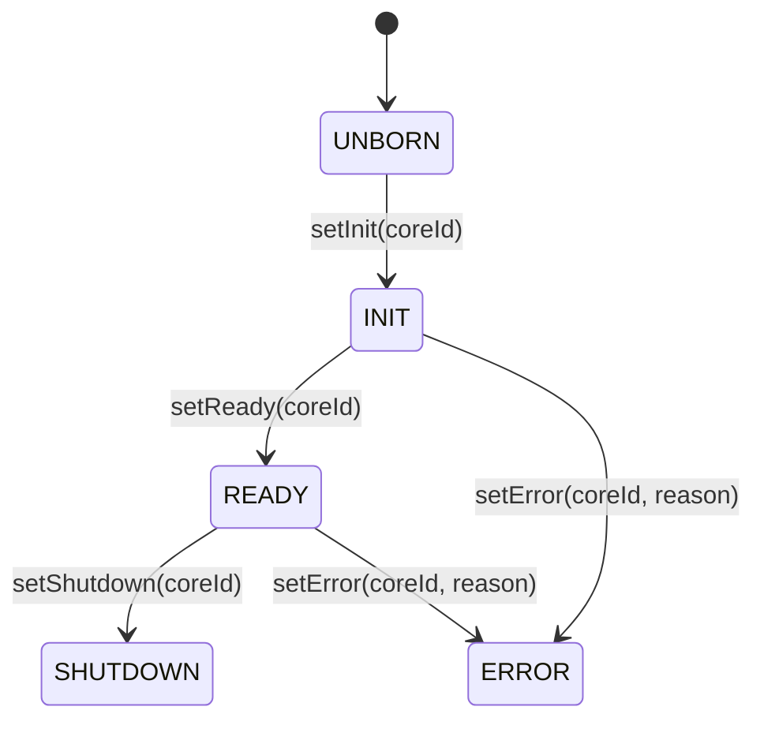
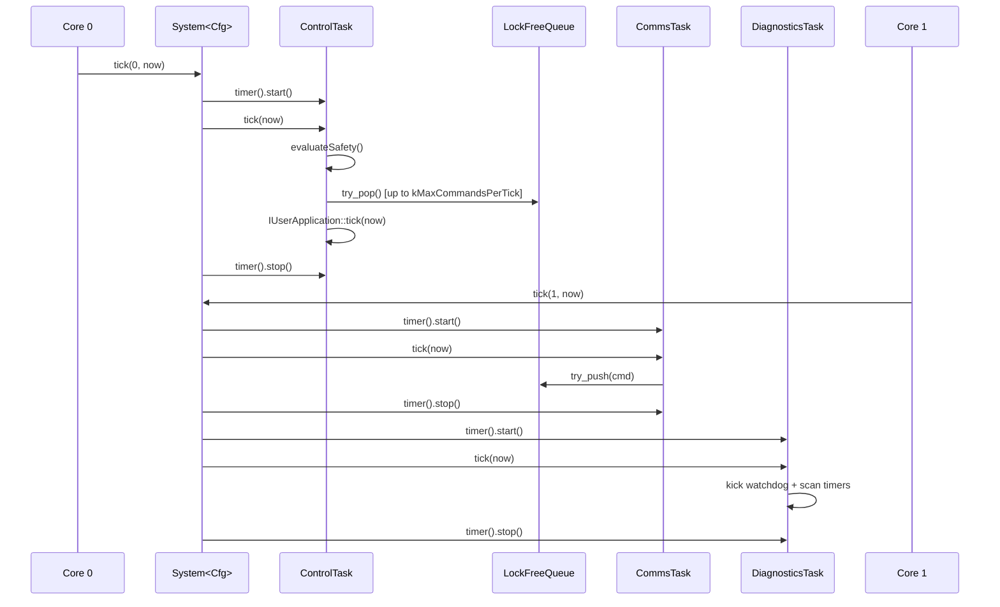
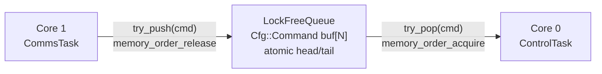

# SputterOS Multi-Core Implementation Guide

How to distribute SputterOS across multiple CPU cores while preserving safety guarantees and deterministic control.

---

## Table of Contents

1. [Why Multi-Core](#why-multi-core)
2. [Core Assignment](#core-assignment)
3. [Configuration](#configuration)
4. [Lifecycle Synchronization](#lifecycle-synchronization)
5. [Dual-Core Reference — RP2350](#dual-core-reference--rp2350)
6. [Watchdog Health Monitoring](#watchdog-health-monitoring)
7. [Inter-Core Command Queue](#inter-core-command-queue)
8. [AtomicDoubleBuffer — Latest-Value Sharing](#atomicdoublebuffer--latest-value-sharing)
9. [Memory Ordering](#memory-ordering)
10. [ISR Registration Across Cores](#isr-registration-across-cores)
11. [Performance Characteristics](#performance-characteristics)
12. [Single-Core Fallback](#single-core-fallback)
13. [Testing Multi-Core Code](#testing-multi-core-code)

---

## Why Multi-Core

| Benefit | Detail |
|---|---|
| True parallelism | `ControlTask` on Core 0, `CommsTask` + `DiagnosticsTask` on Core 1 — no time-sharing overhead |
| Deterministic safety loop | UART ISRs hit Core 1 only; Core 0 tick timing is unaffected |
| Independent sleep | Cores hibernate independently; low-power idle on Core 0 between ticks |
| Simpler scheduling | One tick loop per core, no priority inversion, no RTOS scheduler tuning |

Multi-core adds memory-ordering and synchronization constraints. SputterOS handles these with:
- `LockFreeQueue` - SPSC ring buffer with `std::atomic` acquire/release
- `AtomicDoubleBuffer<T>` - wait-free SWSR double buffer for latest-value sensor/state sharing
- `MultiCoreSync<N>` - lifecycle state machine with barriers
- `WatchdogSync<N>` - per-core heartbeat staleness detection

---

## Core Assignment

### Dual-Core: FLAT_LOOP Mode (Default)

```
Core 0 (Deterministic)              Core 1 (Best-Effort)
──────────────────────              ────────────────────
ScheduledControlTask<Cfg>           ScheduledCommsTask<Cfg>
 • evaluateSafety()                   • CLI + CommandParser
 • processCommands()                  • try_push() → queue
 • IUserApplication::tick()          BackgroundDiagnosticsTask
                                       • watchdog kick
                                       • TaskTimer scan
                                       • MemoryProfiler
```

### Dual-Core: CRUNCH Mode (Core 1 Exclusive)

When `builder.core(1).setCrunchTask()` is called, Core 1 runs a bare `ICrunchTask` tight loop instead of the cooperative scheduler. `ScheduledCommsTask` falls back to Core 0.

```
Core 0 (Deterministic)              Core 1 (CRUNCH)
──────────────────────              ───────────────
ScheduledControlTask<Cfg>           ICrunchTask tight loop:
ScheduledCommsTask<Cfg>  ← fallback   while (active) crunch(now)
BackgroundDiagnosticsTask            No Phase 2. Blocking I/O permitted.
```

### Core Affinity Rules (Enforced by `SystemBuilder::build()`)

| Task Type | Allowed Cores | Rationale |
|---|---|---|
| `IScheduledTask` | Any core | Periodic, cooperative |
| `IBackgroundTask` | Background core (Phase 2) | Best-effort, budget-capped |
| `ICrunchTask` | Core 1+ only (multi-core) | Exclusive tight loop; blocking I/O allowed within `maxIterationUs()` |

`build()` returns a `BuildResult` failure if placement rules are violated.

---

## Configuration

Multi-core mode is activated by setting `kCoreCount >= 2` in your `Cfg` struct:

```cpp
struct MyConfig {
    // ...
    static constexpr std::size_t kCoreCount = 2;   // enables MultiCoreSync
    // ...
};
```

At compile time, `System<Cfg>` selects the synchronization type:

```cpp
// Inside System<Cfg>:
using SyncType = std::conditional_t<kMultiCore, MultiCoreSync<kCoreCount>, NoOpMultiCoreSync>;
//                                  ↑ true when kCoreCount >= 2
```

When `kCoreCount == 1`, `SyncType` is `NoOpMultiCoreSync` - all barrier and state methods are no-ops that return `true`. Your tick loop code compiles identically; only the barrier calls vanish.

---

## Lifecycle Synchronization

`MultiCoreSync<N>` manages a per-core state machine to coordinate startup, runtime, and shutdown.

### CoreState Lifecycle



| State | Value | Meaning |
|---|---|---|
| `UNBORN` | 0 | Core has not started (default) |
| `INIT` | 1 | Core is performing local initialisation |
| `READY` | 2 | Core completed init and is ready to run |
| `ERROR` | 3 | Unrecoverable fault detected |
| `SHUTDOWN` | 4 | Orderly exit requested |

### API

```cpp
template <std::size_t N_CORES>
class MultiCoreSync {
public:
    explicit MultiCoreSync(ICoreErrorHandler* errorHandler = nullptr);

    // State transitions
    void setInit(std::size_t coreId);
    void setReady(std::size_t coreId);
    void setError(std::size_t coreId, const char* reason);
    void setShutdown(std::size_t coreId);

    // Barriers — block until all cores reach target state or timeout
    bool startupBarrier(std::size_t coreId,
                        std::chrono::milliseconds timeout,
                        std::chrono::milliseconds pollInterval = std::chrono::milliseconds{1});

    bool shutdownBarrier(std::size_t coreId,
                         std::chrono::milliseconds timeout,
                         std::chrono::milliseconds pollInterval = std::chrono::milliseconds{1});

    // Selective wait
    bool waitForCore(std::size_t peerId, CoreState targetState,
                     std::chrono::milliseconds timeout,
                     std::chrono::milliseconds pollInterval = std::chrono::milliseconds{1});

    // Queries
    CoreState coreState(std::size_t coreId) const;
    bool anyError() const;
    bool allReady() const;
    bool allTerminated() const;
    static constexpr std::size_t coreCount();
};
```

### Startup Barrier Pattern

Both cores call `startupBarrier()` with their own `coreId`. Each core blocks (polling) until all cores reach `READY` or the timeout expires.

```cpp
// Core 0 (in main, before launching Core 1)
auto& sync = SputterOS::System<Cfg>::multiCoreSync();
sync.startupBarrier(0, std::chrono::milliseconds{2000});

// Core 1 (entry function)
auto& sync = SputterOS::System<Cfg>::multiCoreSync();
sync.startupBarrier(1, std::chrono::milliseconds{2000});
```

If a core fails to reach `READY` within the timeout, the barrier returns `false`. Handle by entering a safe halt.

---

## Dual-Core Reference — RP2350

Complete wiring example using the Pico SDK `multicore_launch_core1()` API.

```cpp
#include "pico/multicore.h"
#include "sputteros/builder/SystemBuilder.h"
#include "sputteros/kernel/System.h"
#include <chrono>
#include <array>

#include "config/MyConfig.h"
#include "hal/MyVacuumGauge.h"
#include "hal/MyContactorRelay.h"
#include "hal/MyArcDetector.h"
#include "hal/MyUsbStream.h"
#include "MyProcessApp.h"
#include "InterlockMonitor.h"
#include "ArcMonitor.h"

using Cfg = MyConfig;
using ms  = std::chrono::milliseconds;

// ─── HAL + safety (constructed on Core 0 before multicore launch) ───
MyVacuumGauge    gauge;
MyContactorRelay contactor;
MyArcDetector    arcDetector;
MyUsbStream      usb;

SputterOS::InterlockManager interlockMgr;
InterlockMonitor interlockMon(&interlockMgr);
ArcMonitor       arcMon(&arcDetector);
std::array<SputterOS::ISafetyMonitor*, 2> monitors = {&interlockMon, &arcMon};

MyProcessApp app(&gauge, &contactor);

// ─── Core 1 entry ───────────────────────────────────────────────────
void core1_entry() {
    auto& sync = SputterOS::System<Cfg>::multiCoreSync();
    if (!sync.startupBarrier(1, ms{2000})) {
        sync.setError(1, "startup timeout");
        return;
    }

    SputterOS::System<Cfg>::init(1);

    while (true) {
        const SputterOS::SputterMicros now = platformGetTimeMicros();
        SputterOS::System<Cfg>::watchdog().kick(1, now);
        SputterOS::System<Cfg>::tick(1, now);
    }
}

// ─── main (Core 0) ─────────────────────────────────────────────────
int main() {
    // 1. Build the system
    SputterOS::SystemBuilder<Cfg> builder(&app, monitors.data(), monitors.size());
    builder.setStream(&usb);
    builder.setWatchdogKick([]() { /* kick HW watchdog */ });

    const SputterOS::BuildResult result = builder.build();
    if (!result) { while (true) {} }

    // 2. Launch Core 1
    multicore_launch_core1(core1_entry);

    // 3. Core 0 startup barrier
    auto& sync = SputterOS::System<Cfg>::multiCoreSync();
    if (!sync.startupBarrier(0, ms{2000})) {
        sync.setError(0, "startup timeout");
        while (true) {}
    }

    // 4. Init + tick on Core 0
    SputterOS::System<Cfg>::init(0);

    while (true) {
        const SputterOS::SputterMicros now = platformGetTimeMicros();
        SputterOS::System<Cfg>::watchdog().kick(0, now);
        SputterOS::System<Cfg>::tick(0, now);
    }
}
```

### What `System::tick(coreId, now)` Does Per Core



`System::tick()` iterates all tasks registered on the given `coreId`, instrumenting each with `TaskTimer::start()`/`stop()`.

---

## Watchdog Health Monitoring

`WatchdogSync<N>` detects stalled cores via per-core heartbeat timestamps.

### API

```cpp
template <std::size_t N_CORES>
class WatchdogSync {
public:
    WatchdogSync();  // all heartbeats initialised to 0

    void kick(std::size_t coreId, std::chrono::milliseconds systemTime);
    // Update heartbeat; mark core as alive. Uses memory_order_release.

    bool isStale(std::size_t coreId,
                 std::chrono::milliseconds systemTime,
                 std::chrono::milliseconds timeout) const;
    // true if core was kicked AND (systemTime - lastKick) > timeout.
    // false if core never kicked (not yet started).

    std::chrono::milliseconds lastKickTime(std::size_t coreId) const;
    bool hasStarted(std::size_t coreId) const;
    static constexpr std::size_t coreCount();
};
```

### Usage Pattern

Each core calls `kick()` at the top of its tick loop. `DiagnosticsTask` checks for staleness:

```cpp
// DiagnosticsTask (Core 1) checks Core 0 health:
auto& wd = SputterOS::System<Cfg>::watchdog();
if (wd.isStale(0, now, std::chrono::milliseconds{200})) {
    SputterOS::System<Cfg>::errorLogger().log(
        ErrorLogger::Code::CORE_STALL, "Core 0 watchdog timeout");
}
```

The hardware watchdog kick callback is set via `SystemBuilder::setWatchdogKick()` and called by `DiagnosticsTask` each tick.

---

## Inter-Core Command Queue

`LockFreeQueue<Cfg, kQueueCapacity>` is the **only** shared mutable state between cores. It is a SPSC (single-producer, single-consumer) ring buffer owned by `System<Cfg>`.



### Key Properties

| Property | Value |
|---|---|
| Algorithm | SPSC ring buffer with power-of-2 masking |
| Memory ordering | `release` on push, `acquire` on pop |
| Blocking | Never — `try_push`/`try_pop` return `false` immediately |
| Latency | < 1 μs per operation on RP2350 |
| Constructor | **Private** — only `System` and `SystemBuilder` can instantiate |
| Access | `System<Cfg>::commandQueue()` returns a reference |
| Capacity | `Cfg::kQueueCapacity` slots |

### Full Queue Behaviour

When `try_push()` returns `false`, `CommsTask` sends a `NACK` response to the operator. Commands are **not silently dropped**.

---

## Memory Ordering

### Golden Rule

**Writer: `memory_order_release` → Reader: `memory_order_acquire`**

The release fence ensures all prior writes (command fields, timestamps, etc.) are visible to the core that performs the acquire load.

```cpp
// Core 1 (producer)
queue.try_push(cmd);  // store tail with release — all cmd fields committed first

// Core 0 (consumer)
queue.try_pop(cmd);   // load head with acquire — sees complete cmd fields
```

### Custom Cross-Core Data

For multi-word structs or any data larger than a single atomic scalar, use `AtomicDoubleBuffer<T>` (see [AtomicDoubleBuffer — Latest-Value Sharing](#atomicdoublebuffer--latest-value-sharing) below) instead of raw atomics.

For single scalar values, `std::atomic` with explicit ordering is also acceptable:

```cpp
// Core 1 writes
std::atomic<float> g_latestPressure{0.0f};
g_latestPressure.store(reading, std::memory_order_release);

// Core 0 reads
float p = g_latestPressure.load(std::memory_order_acquire);
```

**Avoid:** plain assignment to shared non-atomic variables across cores. The compiler and CPU may reorder reads/writes, causing torn or stale values.

---

## AtomicDoubleBuffer — Latest-Value Sharing

`AtomicDoubleBuffer<T, CachePolicy>` is a wait-free, single-writer / single-reader double buffer designed for sharing the **most recent** value of a multi-word struct between cores without locking.

### When to Use

| Use `AtomicDoubleBuffer<T>` | Use `LockFreeQueue<Cfg, N>` |
|---|---|
| Latest sensor reading / setpoint | Every command must be processed |
| High-frequency telemetry snapshots | Order-sensitive command streams |
| Core 1 crunch task writing state back to Core 0 | UART-sourced operator commands |
| Scalar or struct; overwriting stale data is acceptable | Cannot afford to drop any entry |

### Usage

```cpp
#include "sputteros/osal/sync/AtomicDoubleBuffer.h"

struct SensorState { float pressure; float temperature; uint32_t seq; };

// Shared buffer — lives in a struct/class accessible by both cores.
AtomicDoubleBuffer<SensorState> g_sensorState;

// Producer (Core 1):
SensorState s = readSensors();
g_sensorState.write(s);   // memory_order_release + optional cache flush

// Consumer (Core 0):
SensorState latest = g_sensorState.read();  // memory_order_acquire + optional invalidate
```

### Memory Ordering

`write()` stores the slot index with `memory_order_release`; `read()` loads it with `memory_order_acquire`. This establishes a happens-before edge: all fields written by the producer before `write()` are visible to the consumer after `read()`, with no additional fencing required.

### CachePolicy

On platforms with software-managed D-cache, wrap the buffer with a custom policy:

```cpp
struct STM32CachePolicy {
    static void flushBuffer(const void* addr, std::size_t bytes) {
        SCB_CleanDCache_by_Addr(reinterpret_cast<uint32_t*>(const_cast<void*>(addr)),
                                static_cast<int32_t>(bytes));
    }
    static void invalidateBuffer(const void* addr, std::size_t bytes) {
        SCB_InvalidateDCache_by_Addr(reinterpret_cast<uint32_t*>(const_cast<void*>(addr)),
                                     static_cast<int32_t>(bytes));
    }
};

AtomicDoubleBuffer<SensorState, STM32CachePolicy> g_sensorState;
```

The default `NoCachePolicy` compiles to zero overhead on cache-coherent hosts and most Cortex-M platforms.

---

## ISR Registration Across Cores

Register ISRs globally in `main()` before launching Core 1. ISR handlers must touch only atomics or memory-mapped registers — never OS primitives.

```cpp
int main() {
    gpio_set_irq_enabled_with_callback(ARC_DETECT_PIN, GPIO_IRQ_EDGE_RISE,
                                       true, &arcISRHandler);
    multicore_launch_core1(core1_entry);
    // ...
}
```

The ISR may fire on either core. Both cores see the latched event via acquire/release on the `std::atomic<bool>` arc flag.

See [ISR Methodology](ISRMethodology.md) for the complete ISR-safe implementation pattern.

---

## Performance Characteristics

### Single-Core — ISR Interference

```
Time (ms)   Event
────────    ─────────────────────────────────────
0.0         ControlTask tick starts
0.5         evaluateSafety()
1.0         processCommands()
2.0         IUserApplication::tick() completes
2.1         context switch → CommsTask
2.5         UART ISR fires — stalls everything
4.0         ISR returns, CommsTask resumes
9.5         CommsTask tick ends
10.0        next ControlTask tick (delayed)
```

**Problem:** ISR stalls the safety loop. Worst-case ControlTask jitter depends on ISR duration.

> **Note:** The 10 ms timings above assume the default 100 Hz control rate (`kControlBudgetUs = 10000`). Adjust based on your configuration.

### Dual-Core — Isolated Safety Loop

```
Time (ms)   Core 0                        Core 1
────────    ───────────────────────        ───────────────────────
0.0         ControlTask tick starts        CommsTask tick starts
0.5         evaluateSafety()               reading UART
1.0         processCommands()              parsing command
2.0         IUserApplication::tick()       try_push() → queue
2.5         (idle/sleep)                   UART ISR — no impact on Core 0
4.0         (idle/sleep)                   DiagnosticsTask tick
9.5         ControlTask tick ends          Core 1 ticks end
10.0        next ControlTask tick          next CommsTask tick
```

**Benefit:** Core 0 achieves deterministic cycles at the configured rate (default 10 ms / 100 Hz via `kControlBudgetUs`). ISR jitter isolated to Core 1.

---

## Single-Core Fallback

Set `kCoreCount = 1` in your `Cfg` struct:

```cpp
struct MyConfig {
    static constexpr std::size_t kCoreCount = 1;
    // ...
};
```

Effects:
- `SyncType` becomes `NoOpMultiCoreSync` — all barriers return `true` immediately
- All three kernel tasks run on Core 0 in a single tick loop
- `SystemBuilder::build()` skips core-affinity validation for `IAsyncTask`
- `WatchdogSync<1>` still works with a single core heartbeat

Single-core `main()` simplifies to:

```cpp
int main() {
    SputterOS::SystemBuilder<Cfg> builder(&app, monitors.data(), monitors.size());
    builder.setStream(&usb);
    builder.setWatchdogKick([]() { /* ... */ });

    const auto result = builder.build();
    if (!result) { while (true) {} }

    SputterOS::System<Cfg>::init(0);

    while (true) {
        const SputterOS::SputterMicros now = platformGetTimeMicros();
        SputterOS::System<Cfg>::watchdog().kick(0, now);
        SputterOS::System<Cfg>::tick(0, now);  // runs ControlTask + CommsTask + DiagnosticsTask
    }
}
```

---

## Testing Multi-Core Code

### Host Testing (Desktop — Sequential)

Most host-native unit tests run with `TestConfig` configured for `kCoreCount = 1`, so task behaviour can be validated deterministically without requiring concurrent execution. Multi-core behaviour is then exercised separately by dedicated system tests such as the command-delivery, dual-core pipeline, and multi-core sync suites.

```cpp
TEST(MultiCoreQueue, PushPopRoundTrip) {
    // System<TestConfig> owns the queue as a static member.
    // After build(), access via System::commandQueue().
    auto& queue = SputterOS::System<TestConfig>::commandQueue();

    TestConfig::Command cmd{TestConfig::CmdID::SET_STATE, 0, 1.0f};
    ASSERT_TRUE(queue.try_push(cmd));

    TestConfig::Command received;
    ASSERT_TRUE(queue.try_pop(received));
    EXPECT_EQ(received.id, TestConfig::CmdID::SET_STATE);
    EXPECT_FLOAT_EQ(received.value, 1.0f);
}
```

This validates logic correctness but **not** concurrent timing. Timing requires target hardware.

### Target Testing (RP2350 — Concurrent Stress)

Run on the actual dual-core target to measure real contention:

```cpp
void core1_stress() {
    for (int i = 0; i < 10000; ++i) {
        Cfg::Command cmd{Cfg::CmdID::SET_POWER, 0, 50.0f};
        queue.try_push(cmd);
    }
}

void core0_stress() {
    int received = 0;
    Cfg::Command cmd;
    while (received < 10000) {
        if (queue.try_pop(cmd)) ++received;
    }
}
```

Expected: zero lost commands, < 5 μs per operation, no priority inversion.

---

## Common Pitfalls

| Pitfall | Symptom | Fix |
|---|---|---|
| No memory ordering on atomics | Pressure value updated but not seen by other core | Use `memory_order_release` (write) and `memory_order_acquire` (read) |
| Mutex with infinite timeout | Two cores deadlock on queue | Use `LockFreeQueue<Cfg, N>` or bounded chrono timeout |
| ISR writes to non-atomic | Partial update corruption; Data race | Use `std::atomic<>` for all ISR-shared state |
| Shared object not initialized before multicore launch | Garbage data in shared structs | Initialize all shared objects on Core 0 *before* `multicore_launch_core1()` |
| Busy-loop on Core 1 | 100% CPU; other tasks starved | Insert `usleep(1)` or yield if CommsTask has nothing to do |
| Polling same I2C device from both cores | I2C bus conflict; corrupt reads | Pin I2C device polling to one core only (usually Core 1) |
| Core 0 waits for Core 1 result | ControlTask stalls; missed safety ticks | Core 0 must never block on Core 1. Use atomics for async data only. |
| Testing only on single core | Race conditions missed | Run stress tests on target hardware occasionally |

---

## Recommended Configuration by Hardware

### RP2350 (Pico 2) - Dual Core

```
Primary (Core 0)       Secondary (Core 1)
ControlTask            CommsTask
100 Hz, locked         I/O, variable rate
safety-critical        utility
```

**Setup:**
- Core 0: ControlTask only in a loop
- Core 1: `multicore_launch_core1(comms_main)`
- Sync: Lock-free queue with atomic head/tail
- Memory order: `acquire` for pops, `release` for pushes

### FreeRTOS Dual-Core (ESP32, STM32H7 with FreeRTOS)

```
Task              Core Affinity
ControlTask       Core 0 (pinned)
CommsTask         Core 1 (pinned)
DiagnosticsTask   Core 1 (shared)
```

**Setup:**
```cpp
xTaskCreatePinnedToCore(ControlTaskFunc, "ControlTask", ..., 0);  // Core 0
xTaskCreatePinnedToCore(CommsTaskFunc, "CommsTask", ..., 1);      // Core 1
xTaskCreatePinnedToCore(DiagTaskFunc, "DiagTask", ..., 1);        // Core 1
```

- Sync: FreeRTOS mutex with timeout for queue access
- Memory order: FreeRTOS mutex provides implicit acquire/release

### Single-Core Fallback

If only one core available, SputterOS works fine:

```cpp
int main() {
    control.init();
    comms.init();
    diag.init();

    while (true) {
        uint64_t now = platformGetTimeMicros();
        comms.tick(now);      // runs ~2-4 ms
        control.tick(now);    // runs ~2 ms - total ~5 ms < 10 ms budget
        diag.tick(now);       // runs <1 ms
    }
}
```

All three tasks fit in a 10 ms tick window, as long as no single task blocks.

---

## Performance Summary

### Latency (Interrupt to Processing)

| Scenario | Latency |
|---|---|
| Arc ISR on single-core | 0.5-2 ms (ControlTask might be blocked) |
| Arc ISR on dual-core Core 0 | < 0.1 ms (ControlTask polling every 10 ms) |
| UART byte on Core 1 (dual-core) | < 1 us (ISR latch) + ~2 ms for CommsTask tick |

### CPU Utilization

| Task | Typical Load |
|---|---|
| ControlTask | ~20% (2 ms every 10 ms tick) |
| CommsTask | 5–10% (0.5–1 ms variable, heavily I/O dependent) |
| DiagnosticsTask | <1% (polling only) |
| Idle / gap | 70–75% of each dispatch window |

> **Note:** Utilization is measured per **dispatch window** (tick start → tick end). Sleep or idle time between ticks is excluded. This gives a capacity-planning metric: "how full is each tick?" On embedded targets running tight loops without sleep the dispatch window approaches the full tick period.

On dual-core: Both cores mostly idle between ticks (good for power).
On single-core: ~25–30% of each dispatch window utilised; remainder is gap time.

---

## Debugging Multi-Core Issues

### Black-Box Testing (No Debugger)

Use `ErrorLogger` to timestamp events:

```cpp
// Core 0
e_log(ErrorCode::CONTROL_TICK_START, systemTimeMs);
control.tick(systemTimeMs);
e_log(ErrorCode::CONTROL_TICK_END, systemTimeMs);

// Core 1
e_log(ErrorCode::COMMAND_POPPED, systemTimeMs);
commandQueue.try_pop(cmd);
```

Print the error log periodically. Look for timing anomalies (e.g., two CONTROL_TICK events < 9 ms apart).

### Race Condition Detection

Run with ThreadSanitizer on a simulator:

```bash
clang++ -fsanitize=thread -g test.cpp
./a.out  # reports data races
```

Not all targets support this, but catching multi-threading bugs before hardware is valuable.

### Hardware Breakpoints

On Pico, use SWD debugger:

```gdb
# GDB script
break commandQueue.try_pop
commands
silent
print m_head
print m_tail
continue
end
```

Watch atomics during queue operations.

---

## CRUNCH Core Mode

For workloads that require exclusive CPU access and bounded blocking (servo PWM, SPI-based sensor polling, motor controllers), a core can be set to `CoreDispatchMode::CRUNCH` via `CoreBuilder::setCrunchTask()`.

### How It Works

When `System<Cfg>::run(coreId)` is called on a CRUNCH core it executes:

```cpp
// Simplified — no tick(), no Phase 2:
while (isActiveState(s_kernelState) && !anyStopConditionFired())
    core.crunchTask->crunch(s_timer.nowMicros());
```

The standard Phase 1 cooperative scheduler and Phase 2 background dispatch are **not** invoked on a CRUNCH core.

### Registration

```cpp
MyServoTask servo;  // implements ICrunchTask

SputterOS::SystemBuilder<MyCfg> builder(&app, monitors, count);
builder.core(1).setCrunchTask(&servo);
auto result = builder.build();

// On Core 1:
System<MyCfg>::run(1);  // bare crunch loop
```

### Constraints

| Rule | Description |
|------|-------------|
| No Core 0 | CRUNCH core must be Core 1 or higher |
| Exclusive | A CRUNCH core may have no other scheduled tasks |
| Multi-core only | `kCoreCount >= 2` required |
| Period floor | `crunchPeriodUs()` ≥ `kMinSchedulePeriodUs` |

### Overrun Detection

`ICrunchTask::maxIterationUs()` declares the expected worst-case execution time for one `crunch()` call. If that bound is exceeded on `kCrunchMaxOverruns` (default 10) consecutive calls, `onCrunchAbort()` is invoked on the task. The crunch loop continues unless the implementation or a stop condition halts it.

See [SchedulingDesign.md §7](SchedulingDesign.md#crunch-core-mode) for the full dispatch specification.

---

## Summary

- **Dual-core execution** gives true parallelism and lower jitter for safety-critical control.
- **Standard assignment (FLAT_LOOP):** ControlTask on Core 0 (deterministic), CommsTask + DiagnosticsTask on Core 1.
- **CRUNCH assignment:** Core 1 runs an exclusive `ICrunchTask` tight loop; CommsTask falls back to Core 0.
- **Sync mechanism:** `SystemBuilder<Cfg>` provides a built-in `LockFreeQueue<Cfg, N>` accessed via `builder.commandQueue()`. Do not instantiate `LockFreeQueue` directly — its constructor is private.
- **Memory ordering:** Always use `acquire` on reads, `release` on writes to shared atomics.
- **ISRs on either core:** Both cores see ISR latches via acquire/release semantics.
- **Testing:** Single-core tests on host validate logic. Multi-core stress tests on hardware validate timing.
- **Fallback:** Single-core still works; all tasks fit in budget if nothing blocks.

This approach keeps SputterOS deterministic and testable while unlocking the benefits of multi-core hardware.
