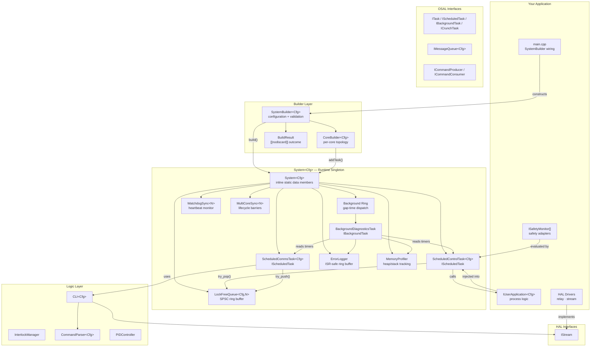
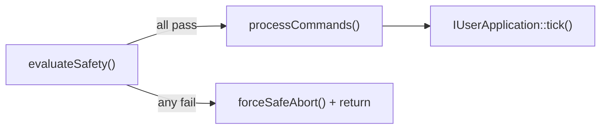
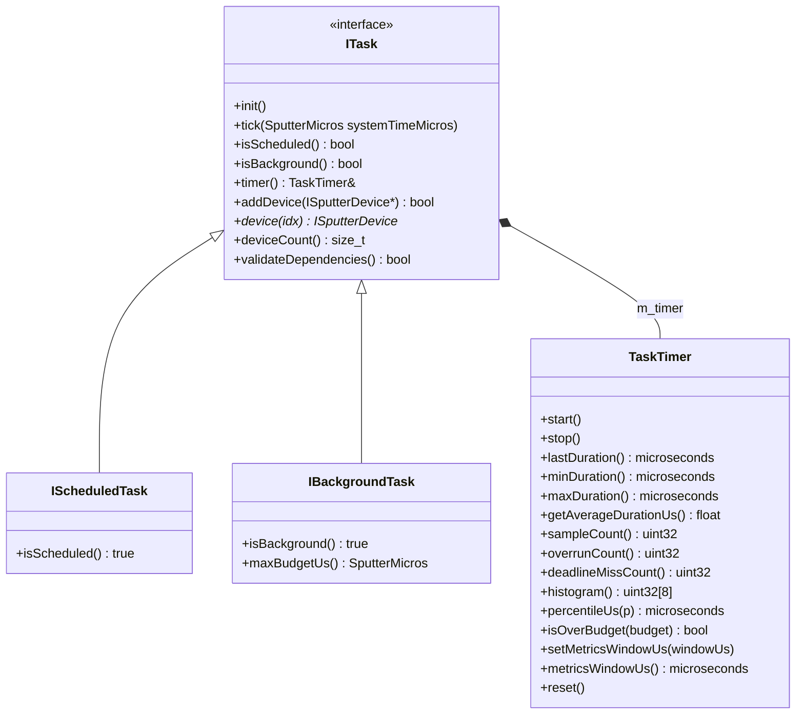
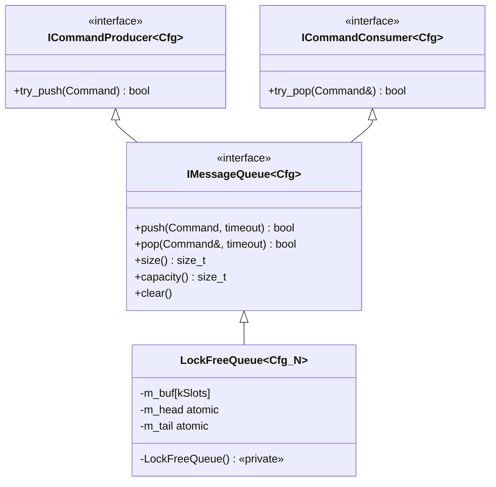
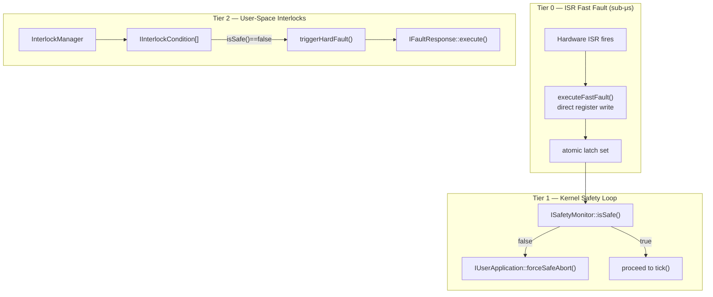

# SputterOS System Architecture

This document details the architectural layers, functional components, and data flow of SputterOS.

---

## Architectural Overview

SputterOS separates concerns into five layers: **Builder**, **Kernel**, **Logic**, **OSAL**, and **HAL**. The user application sits above all layers and injects concrete implementations through pure abstract interfaces.



---

## Layer 1: Builder (`include/sputteros/builder/`)

The builder layer is the **configuration entry point**. It validates the system topology, creates the three kernel tasks, and populates the `System<Cfg>` runtime singleton.

### `SystemBuilder<Cfg>`

Configuration-only builder. Holds user-provided kernel dependencies (`IUserApplication`, `ISafetyMonitor[]`, `IStream`, `WatchdogKickFn`) and per-core `CoreBuilder` instances. After `build()`, the builder's job is done.

**Usage sequence:**
```
1. SystemBuilder<Cfg> builder(&app, monitors, count)   — construct
2. builder.setStream(&stream)                          — inject for CommsTask
3. builder.setWatchdogKick(kickFn)                     — inject for DiagnosticsTask
4. builder.setTelemetryDrain(writeFn, ctx)             — wire telemetry output
5. builder.setTelemetryMutex(&mutex)                   — (multi-core) guard shared logger
6. builder.addStopCondition(predicate)                 — register exit conditions
7. builder.core(0).addScheduledTask(&customTask)       — optional user tasks (FLAT_LOOP core)
   builder.core(1).setCrunchTask(&crunchTask)          — OR: dedicate Core 1 to a tight-loop ICrunchTask
8. auto result = builder.build()                       — validate + populate System
9. System<Cfg>::run(coreId)                            — blocking run loop
```

For multi-core builds, each core calls `run()` from its own thread:
```cpp
std::thread core1([]() { System<Cfg>::run(1); });
System<Cfg>::run(0);
core1.join();
```

### `CoreBuilder<Cfg>`

Per-core topology helper returned by `builder.core(id)`. Wraps `System<Cfg>::CoreData` — task registrations write directly into the singleton's static storage.

### `BuildResult`

`[[nodiscard]]` outcome with `bool ok` and `const char* error`. Implicitly converts to `bool`.

### What `build()` Does

When `IUserApplication` is non-null:

1. Creates `ControlTask<Cfg>` via `KernelConstructTag` PassKey → emplaced into `System::s_controlTask`
2. Creates `CommsTask<Cfg>` → `System::s_commsTask`
3. Creates `BackgroundDiagnosticsTask` → `System::s_diagsTask`
4. Prepends `ScheduledControlTask` to Core 0 and `ScheduledCommsTask` to Core 1 (or Core 0 in single-core). `BackgroundDiagnosticsTask` is registered in the background ring only — it does **not** appear in any core task list.
5. Validates: at least one core has tasks
6. Validates: user task core assignments
7. Validates: task dependencies (`validateDependencies()` on every registered task)
8. Builds flat task list for `BackgroundDiagnosticsTask::setMonitoredTasks()`
9. Sets `System::s_backgroundCoreId` (last active core), then `System::s_built = true`

### Enforcement Mechanisms

| Mechanism | What It Prevents |
|---|---|
| `LockFreeQueue()` private constructor | Direct queue construction bypassing `System` |
| `KernelConstructTag` PassKey | Direct construction of kernel tasks |
| `BuildResult` is `[[nodiscard]]` | Silently discarding `build()` result |
| `assert(s_built)` in `init()`/`tick()` | Runtime before topology validation |
| Core affinity check in `build()` | User tasks placed on wrong core |
| `validateDependencies()` in `build()` | Missing device dependencies at startup |

---

## Layer 2: System — Runtime Singleton (`include/sputteros/kernel/System.h`)

`System<Cfg>` owns **all** shared kernel infrastructure as `inline static` data members. Each unique `Cfg` template argument gets its own independent set of statics — in practice one per binary.

### Static Data Members

| Member | Type | Purpose |
|---|---|---|
| `s_commandQueue` | `LockFreeQueue<Cfg, kQueueCapacity>` | SPSC inter-core command queue |
| `s_watchdog` | `WatchdogSync<kCoreCount>` | Per-core heartbeat monitor |
| `s_sync` | `MultiCoreSync<N>` or `NoOpMultiCoreSync` | Lifecycle barriers (conditional on `kMultiCore`) |
| `s_errorLogger` | `ErrorLogger` | ISR-safe 32-entry circular fault log |
| `s_memProfiler` | `MemoryProfiler` | Heap/stack high-water mark tracking |
| `s_timer` | `SystemTimer` | Kernel-owned wrapper around the injected microsecond source |
| `s_controlTask` | `std::optional<ScheduledControlTask<Cfg>>` | Emplaced by `build()` |
| `s_commsTask` | `std::optional<ScheduledCommsTask<Cfg>>` | Emplaced by `build()` |
| `s_diagsTask` | `std::optional<BackgroundDiagnosticsTask>` | Emplaced by `build()` |
| `s_cores[]` | `CoreData[kCoreCount]` | Per-core scheduled task lists |
| `s_allTasks[]` | `ITask*[kMaxTotalTasks]` | Flat task list for diagnostics |
| `s_allTaskCount` | `std::size_t` | Number of valid entries in `s_allTasks[]` |
| `s_backgroundTasks[]` | `IBackgroundTask*[kMaxBackgroundTasks]` | Background ring (gap-time dispatch) |
| `s_backgroundTaskCount` | `std::size_t` | Number of registered background tasks |
| `s_bgRoundRobin` | `std::size_t` | Current background ring dispatch index |
| `s_backgroundCoreId` | `std::size_t` | Core that runs Phase 2 background dispatch |
| `s_lastDispatch[][]` | `SputterMicros[kCoreCount][kMaxTasksPerCore]` | Last dispatch timestamp per task per core; used by kernel-managed period skip (§2.2) |
| `s_crunchDispatcher` | `CrunchDispatcher<Cfg>` | CRUNCH-mode core runtime; configured and driven by `run()` on CRUNCH cores |
| `s_watchdogKickFn` | `WatchdogKickFn` | Platform watchdog kick callback stored once at build time and forwarded to `CrunchDispatcher` |
| `s_safetyAbort` | `std::atomic<bool>` | Cross-core safety abort flag; set (release store) by `ControlTask::evaluateSafety()`, read (acquire load) by `CrunchDispatcher` each iteration |
| `s_built` | `bool` | Guard flag set by `build()` |
| `s_lastTime[]` | `SputterMicros[kCoreCount]` | Last observed tick time per core for rollover detection |
| `s_telemetryLogger` | `TelemetryLogger` | Kernel-owned shared telemetry logger |
| `s_stopConditions[]` | `StopConditionFn[8]` | User-registered run-loop exit predicates (OR'd) |
| `s_stopConditionCount` | `std::size_t` | Number of registered stop conditions |
| `s_drainFn` | `TelemetryLogger::DrainWriteFn` | Telemetry drain write callback |
| `s_drainCtx` | `void*` | Opaque context for drain callback |
| `s_coreInitialized[]` | `bool[kCoreCount]` | Tracks whether `init()` has been called per core |

### Public Static API

| Method | Description |
|---|---|
| `run(coreId)` | **Blocking run loop.** Internalises init, startup barrier, tick loop, shutdown transitions, and shutdown barrier. Exits when any registered stop condition fires or the kernel leaves an active state. |
| `init(coreId)` | Call `ITask::init()` on every task registered to this core. Called automatically by `run()` if not already done. |
| `tick(coreId, systemTime)` | Tick every task on this core; instruments with `TaskTimer::start()`/`stop()`. Detects timer rollover (logs `TIMER_ROLLOVER` fault). |
| `telemetryLogger()` | Access the kernel-owned `TelemetryLogger` (shared across cores when mutex is set). |
| `commandQueue()` | Access the lock-free command queue |
| `watchdog()` | Access the inter-core watchdog |
| `multiCoreSync()` | Access lifecycle barriers (or no-op stub) |
| `timer()` | Access the kernel-owned `SystemTimer` configured via `SystemBuilder::setClockSource()` |
| `errorLogger()` | Access the kernel-owned error logger |
| `memProfiler()` | Access the kernel-owned memory profiler |
| `isBuilt()` | Query whether `build()` has been called |
| `kernelState()` | Current lifecycle state (`UNCONFIGURED` through `SHUTDOWN`) |
| `signalSafetyAbort()` | Set the cross-core safety abort flag (`memory_order_release`). Called by `ControlTask` on safety failure; read by `CrunchDispatcher` on CRUNCH cores. |
| `isSafetyAborted()` | Query the safety abort flag (`memory_order_acquire`). Returns `true` if a safety abort was signalled. |
| `clearSafetyAbort()` | Clear the safety abort flag (`memory_order_relaxed`). Also cleared automatically by `reset()`. |
| `taskCount(coreId)` | Number of tasks registered on a core |
| `task(coreId, idx)` | Get a task pointer by core and index |

### Per-Core Task Storage (`CoreData`)

Lightweight struct with `ITask* tasks[kMaxTasks]` and `std::size_t taskCount`. Supports `addTask()` (append) and `prependTask()` (shift-right insert at front). `kMaxTasks` is fixed at 256 (full 8-bit range) — the user never needs to tune this value.

---

## Layer 3: Kernel Tasks (`include/sputteros/kernel/`)

Three internal `ITask` implementations in `namespace SputterOS::Kernel`. Constructors require `KernelConstructTag` — only `SystemBuilder<Cfg>` and `KernelTestAccess` can instantiate them.

### `ScheduledControlTask<Cfg>` — Deterministic Safety + Control (`IScheduledTask`)

Runs at a configurable fixed rate (default 100 Hz, set via `kControlBudgetUs`). Each `tick()`:



1. **`evaluateSafety()`** — iterate all `ISafetyMonitor` instances. First `isSafe() == false` → `IUserApplication::forceSafeAbort()` + `System<Cfg>::signalSafetyAbort()` (releases abort flag for CRUNCH cores) + early return
2. **`processCommands()`** — drain up to `CfgMaxCommandsPerTick<Cfg>::value` commands via `ICommandConsumer::try_pop()` → `IUserApplication::handleCommand()`
3. **`IUserApplication::tick(systemTime)`**

**Dependencies:** `ICommandConsumer<Cfg>*` (the queue), `IUserApplication<Cfg>*`, `ISafetyMonitor**`, `size_t monitorCount`

### `ScheduledCommsTask<Cfg>` — Serial Command Reception (`IScheduledTask`)

Runs asynchronously. Supports two modes: TEXT (legacy ASCII) and FRAMED (COBS binary). See [CommsProtocol.md](CommsProtocol.md) for full protocol specification.

**TEXT mode** — Each `tick()`:

1. `CLI<Cfg>::tick()` — drain up to 64 bytes from `IStream`, feed each to `CommandParser<Cfg>`
2. Complete commands → `ICommandProducer::try_push()`. Success → `ACK <cmdId>\n`. Queue full → `NACK <cmdId> <targetDevice> <value>\n`

**FRAMED mode** — Each `tick()`:

1. `CLI<Cfg>::tick()` — feed bytes to `FrameDecoder`, dispatch via `ProtocolRouter` to `IProtocolHandler` callbacks
2. COMMAND frames → `ICommandProducer::try_push()`. Success → framed ACK. Queue full → framed NACK
3. HANDSHAKE_REQ → validates magic, sends HANDSHAKE_RESP
4. EXIT_HANDSHAKE → sends ACK, reverts to TEXT mode
5. METRICS_REQ → sends METRICS_RESP with performance snapshot

`ScheduledCommsTask<Cfg>` implements `IProtocolHandler<Cfg>` to handle all protocol callbacks.

**Dependencies:** `IStream*`, `ICommandProducer<Cfg>*`

### `BackgroundDiagnosticsTask` — System Health Monitor (`IBackgroundTask`)

Non-templated. Dispatched exclusively via Phase 2 (background ring) — not in any core's scheduled task list. Each `tick()`:

1. Kick hardware watchdog via `WatchdogKickFn` (nullable to disable)
2. Scan all monitored `TaskTimer` instances against the configurable control budget (`kControlBudgetUs`, default 10 ms); log overruns to `ErrorLogger`
3. `MemoryProfiler::update()`
4. Every `kMemCheckInterval` (100) ticks: log memory health snapshot

Declares `maxBudgetUs() = 1000` µs per dispatch. The first background task in each round-robin cycle always dispatches unconditionally (see [SchedulingDesign.md §6](SchedulingDesign.md)).

**Dependencies:** `ErrorLogger&`, `MemoryProfiler&`, `WatchdogKickFn`

---

## Layer 4: HAL — Hardware Abstraction (`include/sputteros/hal/`)

Pure abstract C++ interfaces. All inherit `ISputterDevice` (non-copyable, protected ctor, virtual dtor, pure-virtual `isHealthy()`).

| Interface | Key Methods | Notes |
|---|---|---|

| `IStream` | `available()`, `read()`, `write()`, `isConnected()` | Bidirectional byte stream. All non-blocking. Does not inherit `ISputterDevice`. |

### Dummy Stubs (`tests/unit/mocks/`)

1 no-op stub for immediate bring-up without real hardware:

| Stub | Behaviour |
|---|---|
| `DummyStreamReader` | Returns 0 bytes, discards writes |

---

## Layer 5: OSAL — OS Abstraction (`include/sputteros/osal/`)

The OSAL layer is organized into two subfolders:

- **`tasks/`** — Task abstraction hierarchy (`ITask`, `IScheduledTask`, `IBackgroundTask`, `ICrunchTask`)
- **`sync/`** — Synchronization and queuing primitives (`IMessageQueue`, `LockFreeQueue`, `AtomicDoubleBuffer`, `MultiCoreSync`, `WatchdogSync`, `IMutex`, etc.)
- **Root** — Shared types (`SputterTime.h` — 64-bit µs time type and `SystemTimer` class)

### Task Hierarchy



- `IScheduledTask` — dispatched every tick by Phase 1 of `System::tick()`. `ScheduledControlTask` is auto-placed on Core 0; `ScheduledCommsTask` on Core 1 (or Core 0 in single-core).
- `IBackgroundTask` — dispatched by Phase 2 of `System::tick()` in round-robin order on the background core. `maxBudgetUs()` declares the task's maximum allowed wall-clock budget per dispatch.
- `TaskTimer` — embedded in every `ITask`; `System::tick()` instruments `start()`/`stop()` for both scheduled and background tasks.
- **Device Dependencies** — `ITask` tracks up to 16 registered `ISputterDevice*` pointers via `addDevice()`. Override `validateDependencies()` to declare required devices; `SystemBuilder::build()` calls this on every task and fails the build if any returns `false`.

### Message Queue Hierarchy



- `LockFreeQueue<Cfg, N>` — SPSC ring buffer. Private constructor; only `System<Cfg>` (friend) can instantiate.
- `ICommandProducer` — write-only view used by `CommsTask`
- `ICommandConsumer` — read-only view used by `ControlTask`

### Synchronization Primitives

| Class | Purpose |
|---|---|
| `AtomicDoubleBuffer<T, CachePolicy>` | Wait-free SWSR double buffer for latest-value cross-core data sharing. `write()` stores with `memory_order_release`; `read()` loads with `memory_order_acquire`. Default `NoCachePolicy` is zero-cost on cache-coherent platforms; provide a custom `CachePolicy` with `flushBuffer`/`invalidateBuffer` statics for devices with non-coherent D-cache (STM32H7, ESP32-S3). |
| `MultiCoreSync<N>` | Per-core lifecycle state machine: `UNBORN → INIT → READY → SHUTDOWN` (or `ERROR`). Startup/shutdown barriers with `std::chrono::milliseconds` timeouts. |
| `WatchdogSync<N>` | Atomic heartbeat per core. `kick(coreId, time)` updates timestamp; `isStale(coreId, time, timeout)` detects hangs. |
| `NoOpMultiCoreSync` | Stub for single-core configs (`kCoreCount < 2`). All methods are no-ops. |
| `SputterTime` | Type alias: `SputterMicros` (`uint64_t`), `MicrosecondSource` function pointer, `SystemTimer` class with `nowMicros()` (zero-based uptime from clock injection time), `milliseconds()`, `seconds()`. |

---

## Logic & Utility Components

### Logic Layer (`src/logic/`)

| Component | Description |
|---|---|
| `IUserApplication<Cfg>` | Primary kernel integration contract: `init()`, `tick()`, `handleCommand()`, `forceSafeAbort()` |
| `ISafetyMonitor` | Generic failsafe interface: `isSafe() → bool`, `name() → const char*` |
| `InterlockManager` | Registered `IInterlockCondition` evaluator + `IFaultResponse` executor. Hard/soft fault model. |
| `CommandParser<Cfg>` | ASCII byte-by-byte parser: `<CmdID> <targetDevice> <value>\n`. 64-byte buffer with auto-reset. |
| `IProcessState` | Per-phase interface: `onEnter()`, `execute(SputterMicros systemTimeMicros)`, `onExit()` |
| `IUserApplication<Cfg>` | User-space application injected into ControlTask. Provides `init()`, `tick()`, `handleCommand()`, `forceSafeAbort()`. |

### Utility Layer (`include/sputteros/utils/` and `src/utils/`)

The utility layer is organized into two subfolders:

- **`logging/`** — Logging and diagnostic components (`ErrorLogger`, `TelemetryLogger`, `LightweightStringBuilder`)
- **Root** — Standalone timing and control utilities (`MemoryProfiler`, `NonBlockingStopwatch`, `PIDController`)

| Component | Description |
|---|---|
| `CLI<Cfg>` | Stream + parser + string builder wrapper. `tick()` drains 64 bytes/call. |
| `ErrorLogger` | ISR-safe 32-entry circular ring buffer. 8 error codes (including `TIMER_ROLLOVER`). `std::chrono::milliseconds` timestamps. |
| `PIDController` | Discrete PID with anti-windup. `compute(setpoint, feedback, time)`. Call `reset()` on phase transitions. |
| `TelemetryLogger` | Task-tagged, verbosity-filtered live output. 32-entry buffer, drains to `IStream`. |
| `MemoryProfiler` | Heap/stack high-water mark tracking. Platform stubs return 0 — subclass for real hardware. |
| `LightweightStringBuilder` | 128-byte fixed-capacity heap-free formatter. Chainable `append()`. |
| `NonBlockingStopwatch` | Monotonic timer: `hasExpired(time, duration) → bool`. |
| `TaskTimer` | Per-task execution timer with injectable clock. Tracks last/min/max/average duration, sample count, overrun count, deadline-miss count, and an 8-bucket duration histogram (512 µs per bucket). A **time-based rolling window** (default 60 s, configurable via `kMetricsWindowUs`) prevents counter overflow in high-frequency schedulers — accumulators are snapshotted and reset each window. Embedded in every `ITask`. |
| `CoreUtilizationTracker` | Per-core windowed busy/total accumulator. Wall time is the dispatch window (tick start → tick end), excluding sleep between ticks. Auto-resets every 1000 ticks; exposes `getUtilization()` for the last complete window. |
| `SchedulerHealthMetrics` | Aggregate gap-time (idle time per tick), peak gap, total overruns, and total deadline misses across all tasks. Uses the same **time-based rolling window** as `TaskTimer` to prevent counter overflow. |
| `QueueDepthMonitor` | Command queue depth tracker: last/max/average depth. Uses the same **time-based rolling window** as `TaskTimer` to prevent counter overflow. |
| `PerformanceSnapshot` | POD value type (~1.2 KiB on stack). Captures a point-in-time copy of all metrics: per-core utilization, per-task histograms, queue depth, memory, and scheduler health. Returned by `System<Cfg>::snapshot()`. |
| `PerformanceFormatter` | Heap-free formatter consuming a `PerformanceSnapshot`. Writes key=value or CSV text into a caller-provided `char` buffer. Uses integer arithmetic for float formatting. |

---

## Configuration — Template ConfigTraits

SputterOS uses **compile-time template parameters**. Define a plain struct satisfying the `ConfigTraits` contract in `include/sputteros/ConfigTraits.h`:

| Member | Type | Required | Default |
|---|---|---|---|
| `State` | `enum class` | Yes | — |
| `CmdID` | `enum class : uint8_t` | Yes | — |
| `Command` | `struct { CmdID id; uint8_t targetDevice; float value; }` | Yes | — |
| `kCoreCount` | `static constexpr std::size_t` | Yes | — |
| `kQueueCapacity` | `static constexpr std::size_t` | Yes | — |
| `kMaxCommandsPerTick` | `static constexpr int` | Optional | 8 |
| `kMaxValidCommandID` | `static constexpr uint8_t` | Optional | 255 |
| `kControlBudgetUs` | `static constexpr uint32_t` | Optional | 10000 (10 ms / 100 Hz) |
| `kMetricsWindowUs` | `static constexpr uint64_t` | Optional | 60 000 000 (60 s) |
| `kMaxBackgroundTasks` | `static constexpr std::size_t` | Optional | 16 |
| `kCrunchMaxOverruns` | `static constexpr uint32_t` | Optional | 10 |

`ConfigValidator<Cfg>` enforces `static_assert` checks at template instantiation.

---

## Data Flow — Single Tick

```mermaid
sequenceDiagram
    participant Main as main() loop
    participant Sys as System&lt;Cfg&gt;::tick()
    participant CT as ScheduledControlTask
    participant App as IUserApplication
    participant CMT as ScheduledCommsTask
    participant CLI as CLI&lt;Cfg&gt;
    participant Q as LockFreeQueue
    participant DT as BackgroundDiagnosticsTask

    Main->>Sys: tick(0, now) [Core 0 — Phase 1]
    Sys->>CT: timer.start() → tick(now) → timer.stop()
    CT->>CT: evaluateSafety() — ISafetyMonitor[]
    CT->>Q: try_pop() × kMaxCommandsPerTick
    Q-->>CT: Command (or empty)
    CT->>App: handleCommand(cmd)
    CT->>App: tick(now)

    Main->>Sys: tick(1, now) [Core 1 — Phase 1]
    Sys->>CMT: timer.start() → tick(now) → timer.stop()
    CMT->>CLI: tick() — drain bytes from IStream
    CLI->>Q: try_push(cmd)
    Q-->>CLI: success/full
    CLI-->>CMT: ACK or NACK

    Note over Sys: Phase 2 — background dispatch (Core 1 only, gap-time)
    Sys->>DT: timer.start() → tick(now) → timer.stop()
    DT->>DT: kickWatchdog()
    DT->>DT: scan TaskTimers for budget violations
    DT->>DT: MemoryProfiler::update()
```

---

## Safety Architecture

### Three-Tier Safety Model



- **Tier 0 (ISR):** `executeFastFault()` in HAL drivers runs inside the ISR — sub-microsecond hardware disable
- **Tier 1 (Kernel):** `ControlTask::evaluateSafety()` iterates `ISafetyMonitor[]` every tick; first failure → `forceSafeAbort()`
- **Tier 2 (User-space):** `InterlockManager` evaluates registered `IInterlockCondition` objects. Wrap in `ISafetyMonitor` adapter for kernel evaluation.

### ISafetyMonitor vs InterlockManager Boundary

These two safety mechanisms serve different tiers and should not be confused:

| Aspect | `ISafetyMonitor` (Kernel Tier) | `InterlockManager` (User Tier) |
|---|---|---|
| **Layer** | Kernel (`ControlTask`) | Logic (user-space) |
| **Evaluation** | Every tick, before `processCommands()` | On-demand via `checkAllInterlocks()` |
| **Latency** | Sub-microsecond (must be non-blocking) | May involve complex multi-condition evaluation |
| **Failure action** | Immediate `forceSafeAbort()` — kernel-enforced | Soft abort / hard fault — user decides severity |
| **Interface** | `isSafe() → bool` | `IInterlockCondition::isSafe() → bool` |
| **Cardinality** | Small fixed array (passed to `SystemBuilder`) | Up to `kMaxConditions` registered dynamically |
| **Naming** | Unified: both use `isSafe()` returning `true` = nominal |

**Bridge pattern:** To evaluate `InterlockManager` conditions within the kernel safety loop, wrap it in an `ISafetyMonitor` adapter (see [ImplementationGuide.md](ImplementationGuide.md) for the `InterlockMonitor` adapter example).

---

## Core Affinity Rules

| Task Type | Core 0 | Core 1+ | Background Ring |
|---|---|---|---|
| `IScheduledTask` (user) | Allowed | Allowed (FLAT_LOOP core only) | — |
| `ScheduledControlTask` | Always Core 0 | N/A | — |
| `ScheduledCommsTask` | Single-core; or Core 0 fallback when Core 1 is CRUNCH | Core 1 in standard dual-core | — |
| `ICrunchTask` | Not allowed (Core 0 is reserved for safety loop) | Core 1+ only; one per core; no other tasks on that core | — |
| `IBackgroundTask` | Dispatched if `s_backgroundCoreId == 0` | Dispatched if `s_backgroundCoreId == coreId` | **Registered here** |
| `BackgroundDiagnosticsTask` | Core 0 (single-core) | Core 1 (dual-core) | Slot 0 |

In single-core mode (`kCoreCount == 1`), all scheduled tasks run on Core 0 and the background core is also Core 0.

---

## Data Flow Summary

1. **Command reception**: The platform scheduler calls `CommsTask<Cfg>::tick(SputterMicros systemTimeMicros)` each cycle. `CLI<Cfg>` drains the `IStream` byte stream, `CommandParser<Cfg>` assembles ASCII lines into `Cfg::Command` packets, and `CommsTask` pushes validated packets into the `LockFreeQueue<Cfg, N>` via `ICommandProducer::try_push()`. On success the host receives `ACK <cmdId>\n`; if the queue is full the host receives `NACK <cmd_id> <sub_id> <value>\n`.

2. **Safety evaluation**: `ControlTask<Cfg>::tick(SputterMicros systemTimeMicros)` calls `evaluateSafety()` first. It iterates all registered `ISafetyMonitor` instances and calls `isSafe()` on each. Any monitor returning `false` immediately calls `IUserApplication<Cfg>::forceSafeAbort()` and returns before the application ticks.

3. **Command dispatch**: `ControlTask<Cfg>` drains up to `CfgMaxCommandsPerTick<Cfg>::value` entries from the `LockFreeQueue` via `ICommandConsumer::try_pop()` and forwards each to `IUserApplication<Cfg>::handleCommand()`. The concrete implementation decides how to route each command - whether to trigger a phase transition, update a setpoint, or pass it through to the active process phase.

4. **Process execution**: `IUserApplication<Cfg>::tick(SputterMicros systemTimeMicros)` is delegated to the user-provided concrete implementation. A typical implementation advances the active `IProcessState::execute(SputterMicros systemTimeMicros)` phase, which reads sensors through HAL interfaces, feeds readings into `PIDController` and `NonBlockingStopwatch`, and drives actuator setpoints. When a transition condition is met the phase initiates the appropriate transition.

5. **Health monitoring**: `BackgroundDiagnosticsTask::tick(SputterMicros systemTimeMicros)` is dispatched by **Phase 2 of `System::tick()`** on the background core (Core 1 in dual-core, Core 0 in single-core). It kicks the hardware watchdog, scans all monitored per-task `TaskTimer` instances for budget violations, updates `MemoryProfiler` high-water marks, and periodically logs a memory snapshot to `ErrorLogger`. The first background task in the round-robin ring always dispatches unconditionally each tick, guaranteeing health monitoring runs even when Phase 1 saturates the budget.

6. **Telemetry response**: Phase implementations or tasks format responses using `LightweightStringBuilder`, deposit them into `CLI<Cfg>`'s builder, and call `CLI<Cfg>::flush()` to write back through `IStream`.

---

## Dependency Injection and Startup Sequence

The recommended startup sequence in `main.cpp`:

```
1. Construct all concrete HAL objects   (relays, stream, and any domain-specific devices you define)
2. Implement and construct ISafetyMonitor adapters  (wrapping InterlockManager or domain checks)
3. Implement and construct your concrete IUserApplication<Cfg> and its IProcessState phase objects; wire device pointers into them
4. Construct SystemBuilder<Cfg> with IUserApplication and ISafetyMonitor[] pointers
5. Call builder.setStream(&stream) to enable CommsTask
6. Call builder.setWatchdogKick(kickFn) to enable DiagnosticsTask watchdog (optional)
7. Optionally add user tasks: builder.core(0).addTask(&customTask)
8. Call builder.build() — validates topology, creates kernel tasks, enforces core affinity
9. Call `System<Cfg>::init(coreId)` — initialises all tasks on that core
10. Enter the scheduler loop, calling `System<Cfg>::tick(coreId, SputterMicros(...))` each cycle
```

The kernel tasks (`ScheduledControlTask`, `ScheduledCommsTask`, `BackgroundDiagnosticsTask`) are created internally by `build()` — the user never sees their constructors. `ScheduledControlTask` is prepended to Core 0, `ScheduledCommsTask` is prepended to Core 1 (or Core 0 in single-core), and `BackgroundDiagnosticsTask` is placed in slot 0 of the background ring. User scheduled tasks follow kernel tasks in tick order; user background tasks follow `BackgroundDiagnosticsTask` in the ring.

Failing to call `build()` before `init()` triggers an assertion. Discarding the `BuildResult` is a compiler warning (`[[nodiscard]]`).
