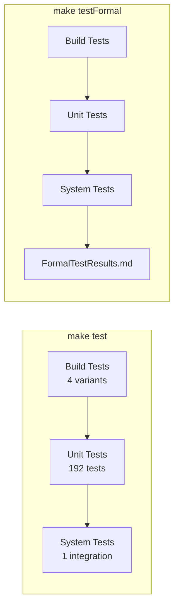

# SputterOS Testing Guide

SputterOS uses three complementary test suites — all running on the host without embedded hardware.

---

## Table of Contents

1. [Test Overview](#test-overview)
2. [Quick Start](#quick-start)
3. [Build Tests](#build-tests)
4. [Unit Tests](#unit-tests)
5. [System Tests](#system-tests)
6. [Formal Test Report](#formal-test-report)
7. [Adding New Tests](#adding-new-tests)
8. [Troubleshooting](#troubleshooting)

---

## Test Overview

| Suite | Scope | Count | Framework | Command |
|---|---|---|---|---|
| **Build Tests** | C++17 compilation across 4 architecture variants | 4 | Bare executables + CTest | `make runBuildTests` |
| **Unit Tests** | Logic, tasks, utils, OSAL interfaces | 192+ | GoogleTest 1.15.2 / CTest | `make unitTest` |
| **System Tests** | Full pipeline integration (SystemBuilder → tick loop) | 1 | Executable + CTest | `make systemTest` |
| **Total** | | **197+** | | `make test` |



---

## Quick Start

```bash
# Run all tests (build + unit + system)
make test

# Run all tests and generate formal report
make testFormal

# Run only unit tests (fastest iteration loop)
make unitTest

# Clean all build artifacts
make clean
```

### Prerequisites

- C++17 compiler (GCC, Clang, or MSVC)
- CMake ≥ 3.14
- Ninja build system
- pthreads (Unix) or Win32 threads (Windows)
- GoogleTest — fetched automatically via `FetchContent`

---

## Build Tests

### Purpose

Verify that SputterOS compiles and links cleanly across four architecture × core-count combinations. Each variant exercises different template instantiations, alignment rules, and word-size arithmetic.

### Variants

| Variant | Data Model | Cores | Source | What It Tests |
|---|---|---|---|---|
| `build_32bit_1core` | 32-bit | 1 | `main_1core.cpp` | ARM M0/M4 class — HeartbeatTask + AccumulatorTask |
| `build_64bit_1core` | 64-bit | 1 | `main_1core.cpp` | Desktop OS class — same tasks, 64-bit arithmetic |
| `build_32bit_2core` | 32-bit | 2 | `main_2core.cpp` | RP2350 native — ProducerTask/ConsumerTask via queue |
| `build_64bit_2core` | 64-bit | 2 | `main_2core.cpp` | Desktop multi-core — concurrent `std::thread` simulation |

### Structure

```
tests/buildTest/
├── CMakeLists.txt              ← add_bare_variant() macro
├── main_1core.cpp              ← HeartbeatTask + AccumulatorTask (10k ticks)
├── main_2core.cpp              ← ProducerTask ↔ ConsumerTask (std::thread)
└── configs/
    ├── 32bit_1core/BuildConfig.h
    ├── 64bit_1core/BuildConfig.h
    ├── 32bit_2core/BuildConfig.h
    └── 64bit_2core/BuildConfig.h
```

Each `BuildConfig.h` contains `static_assert` guards enforcing the intended data model (e.g. `sizeof(word_t) == 4`).

### Running

```bash
make runBuildTests     # build + run all 4 via CTest

# Or manually:
cd tests/buildTest/build
cmake .. -G Ninja
ninja
ctest --output-on-failure
```

### Expected Output

```
=== SputterOS Bare Build Verification ===
  Data model : 32-bit
  Cores      : 1
  Queue cap  : 16
  Max tasks  : 4
==========================================

Simulation result (10000 ticks):
  Heartbeat beats  : 10 (expected: 10)
  Accumulator sum  : 49995000
  Tasks registered : 2
  tick_t wraps at  : 2^32  (~49 days @ 1 ms)

Build OK
```

All 4 variants must print `Build OK` and exit with code 0.

### Compilation Flags

All variants compile with strict warnings:
- GCC/Clang: `-Wall -Wextra -Wpedantic -Werror`
- MSVC: `/W4 /WX`

---

## Unit Tests

### Purpose

Validate core SputterOS algorithms and interfaces using GoogleTest. Tests run on the host with mock HAL/OSAL implementations — no embedded hardware or RTOS.

### Structure

```
tests/unit/
├── CMakeLists.txt             ← FetchContent(googletest v1.15.2)
├── config/                    ← TestConfig.h
├── mocks/                     ← Mock HAL/OSAL headers
├── logic/                     ← 37 tests
│   ├── CMakeLists.txt
│   ├── test_CommandParser.cpp
│   └── test_InterlockManager.cpp
├── tasks/                     ← 33+ tests
│   ├── CMakeLists.txt
│   ├── test_ControlTask.cpp
│   ├── test_CommsTask.cpp
│   ├── test_DiagnosticsTask.cpp
│   ├── test_SystemBuilder.cpp
│   └── test_TaskTimer.cpp
├── utils/                     ← 104+ tests
│   ├── CMakeLists.txt
│   ├── test_PIDController.cpp
│   ├── test_LightweightStringBuilder.cpp
│   ├── test_ErrorLogger.cpp
│   ├── test_NonBlockingStopwatch.cpp
│   ├── test_MemoryProfiler.cpp
│   ├── test_CLI.cpp
│   ├── test_TelemetryLogger.cpp
│   └── test_OpResult.cpp
└── osal/                      ← 18+ tests
    ├── CMakeLists.txt
    ├── test_ITask.cpp
    ├── test_MultiCoreSync.cpp
    ├── test_LockFreeQueue.cpp
    ├── test_SputterTime.cpp
    └── test_WatchdogSync.cpp
```

### Test Breakdown

| Layer | Tests | Executable Pattern | Label |
|---|---|---|---|
| Logic | 37 | `test_logic_command_parser`, `test_logic_interlock_manager` | `logic` |
| Tasks | 33+ | `test_tasks_control_task`, `test_tasks_comms_task`, `test_tasks_diagnostics_task`, `test_tasks_system_builder`, `test_tasks_task_timer` | `tasks` |
| Utils | 104+ | `test_utils_pid_controller`, `test_utils_cli`, `test_utils_op_result`, etc. | `utils` |
| OSAL | 18+ | `test_osal`, `test_osal_lock_free_queue`, `test_osal_sputter_time`, `test_osal_watchdog_sync` | `osal` |
| **Total** | **192+** | | |

### Running

```bash
# Build and run all unit tests
make unitTest

# Run by label
cd tests/unit/build
ctest --label-regex logic   --output-on-failure
ctest --label-regex tasks   --output-on-failure
ctest --label-regex utils   --output-on-failure
ctest --label-regex osal    --output-on-failure

# Run a single test pattern
ctest --output-on-failure -R "test_tasks_control"
```

### GoogleTest Integration

GoogleTest is fetched automatically — no manual installation required:

```cmake
include(FetchContent)
FetchContent_Declare(
    googletest
    GIT_REPOSITORY https://github.com/google/googletest.git
    GIT_TAG        v1.15.2
)
FetchContent_MakeAvailable(googletest)
```

Each test source file produces its own executable linked against `GTest::gtest_main` and `GTest::gmock`.

### Test Config

All unit tests share `TestConfig` (`tests/unit/config/TestConfig.h`) which satisfies the `ConfigTraits` contract. If you add new `CmdID` values or change `kQueueCapacity`, update `TestConfig` to match.

### Mocks

Mock implementations are in `tests/unit/mocks/`. They implement HAL and OSAL interfaces with controllable behaviour for deterministic testing:

```cpp
// Example: MockStreamReader stores written bytes for inspection
class MockStreamReader : public SputterOS::IStreamReader {
    // ...
};
```

---

## System Tests

### Purpose

Full-pipeline integration tests that exercise the complete SystemBuilder → System → tick loop path with real SputterOS library code.

### Current Tests

| Test | Location | Description |
|---|---|---|
| `heartbeat_osNative` | `tests/systemTests/heartbeat/` | Builds a complete System with HeartbeatStateMachine, PulseTask, and all 3 kernel tasks. Runs tick loop with `std::chrono` timing on the host. |

### Structure

```
tests/systemTests/heartbeat/
├── CMakeLists.txt
├── src/main_osNative.cpp         ← SystemBuilder wiring + tick loop
├── config/HeartbeatConfig.h      ← Cfg struct for heartbeat demo
├── hal_impl/HeartbeatHAL.h       ← Concrete HAL stubs
├── osal_impl/HeartbeatOSAL.h     ← Concrete OSAL stubs
└── include/
    ├── HeartbeatStateMachine.h   ← IUserApplication implementation
    └── PulseTask.h               ← Custom user task
```

### Running

```bash
make systemTest

# Or manually:
cd tests/systemTests/build
cmake .. -G Ninja
ninja
ctest --output-on-failure --timeout 30
```

The heartbeat test has a 30-second timeout. It validates that the full tick pipeline runs without assertion failures or crashes.

---

## Formal Test Report

### Purpose

Aggregates all test suites into a single timestamped markdown document for CI/CD, code reviews, and release documentation.

### Running

```bash
make testFormal
# Generates: FormalTestResults.md
```

### Report Contents

- Test summary table with pass/fail counts
- Build test results per variant (compile time, runtime, status)
- Unit test results per label group (logic, tasks, utils, osal)
- SputterOS static library size
- Environment info (compiler, CMake version, OS)
- Overall PASS/FAIL verdict

### Example Output

```
## ✓ OVERALL RESULT: PASS
All test suites passed; safe for integration.

| Suite               | Status  | Count | Details                              |
|---------------------|---------|-------|--------------------------------------|
| Build Tests         | ✓ PASS  | 4     | 32/64-bit × 1/2-core               |
| Unit Tests          | ✓ PASS  | 192   | logic 37 + tasks 33 + utils 104 + osal 18 |
| System Tests        | ✓ PASS  | 1     | heartbeat_osNative                   |
| SputterOS Library   | ✓ SIZE  | —     | 57KB static archive                  |
```

### Gitignore

The report is a generated artifact:
```
# Generated by: make testFormal
FormalTestResults.md
```

---

## Adding New Tests

### New Unit Test

1. Create `tests/unit/<layer>/test_YourComponent.cpp` using GoogleTest macros
2. Add to the layer's `CMakeLists.txt`:
   ```cmake
   add_executable(test_<layer>_your_component test_YourComponent.cpp)
   target_link_libraries(test_<layer>_your_component GTest::gtest_main GTest::gmock SputterOS)
   gtest_discover_tests(test_<layer>_your_component PROPERTIES LABELS "<layer>")
   ```
3. Run `make unitTest` to verify

### New Build Variant

1. Create `tests/buildTest/configs/<name>/BuildConfig.h` with `static_assert` guards
2. In `tests/buildTest/CMakeLists.txt`, call `add_bare_variant(<name> <main_source>)`
3. Add CTest: `add_test(NAME <name> COMMAND <name>)`

### New System Test

1. Create a new directory under `tests/systemTests/` (follow the `heartbeat/` pattern)
2. Implement: `Cfg` struct, HAL stubs, `IUserApplication`, `main.cpp` with SystemBuilder wiring
3. Add to `tests/systemTests/CMakeLists.txt`

---

## Troubleshooting

### Build Tests Fail to Compile

```bash
cd tests/buildTest/build
cmake -DCMAKE_VERBOSE_MAKEFILE=ON .. -G Ninja
ninja -v
```

Check that the variant's `BuildConfig.h` matches the intended data model (`sizeof(word_t)` assertions).

### Unit Tests Crash or Timeout

```bash
cd tests/unit/build
ctest --output-on-failure --verbose
```

Common causes:
- `System<TestConfig>::s_built` not set — test forgot to call `builder.build()`
- Queue deadlock in mock — ensure `try_push`/`try_pop` are non-blocking
- Config mismatch — `TestConfig.h` doesn't match source changes

### System Test Exceeds 30s Timeout

The heartbeat system test should complete in < 5 seconds. If it times out:
- Check for infinite loops in your `IUserApplication::tick()` or `IProcessState::execute()`
- Verify the tick loop increments time (not stuck at the same `SputterMicros`)

### `make test` Fails Partway

`make test` runs: `runBuildTests` → `unitTest` → `systemTest` in sequence. The first failure stops execution. Run each target individually to isolate:

```bash
make runBuildTests   # pass?
make unitTest        # pass?
make systemTest      # pass?
```

### GoogleTest Not Found

GoogleTest is fetched via CMake `FetchContent` on first build. If network access is unavailable:
- Pre-populate `tests/unit/build/_deps/googletest-src/` from a local clone
- Or set `FETCHCONTENT_FULLY_DISCONNECTED=ON` with a pre-cached build directory

### Test Count Regression

After adding source code, run `make testFormal` and check the unit test count in `FormalTestResults.md`. If the count dropped, a test file may have been accidentally excluded from `CMakeLists.txt`.

---

## Performance

| Suite | Compile | Execute | Total |
|---|---|---|---|
| Build Tests | ~2s (4 variants) | ~0.03s | ~2s |
| Unit Tests | ~10s (GoogleTest fetch + compile) | ~1.3s | ~11s |
| System Tests | ~3s | ~1s | ~4s |
| **All (`make test`)** | | | **~17s** |

Subsequent builds (no source changes) skip recompilation; only CTest execution runs.
